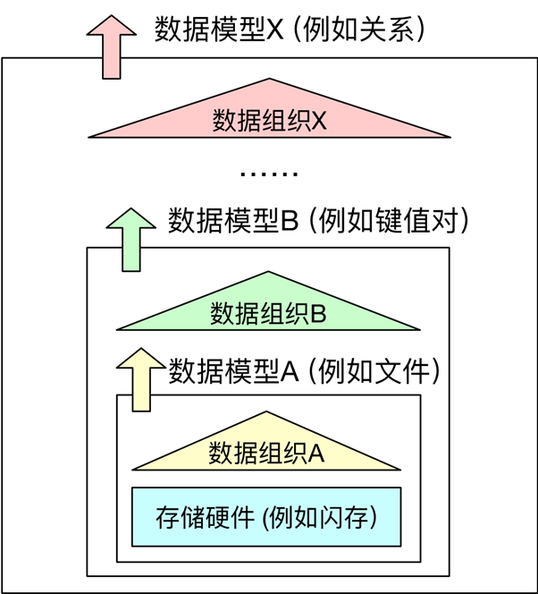
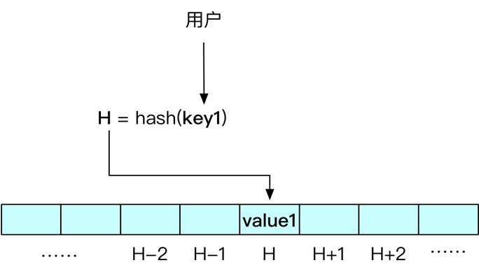
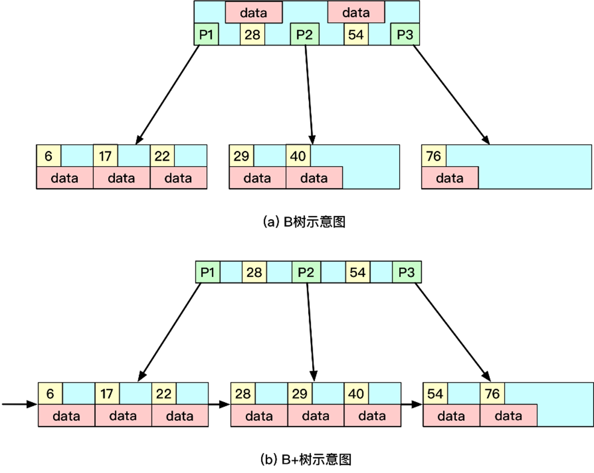
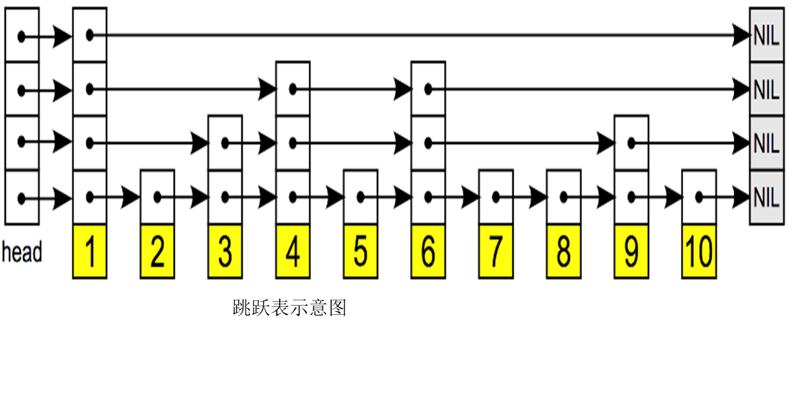
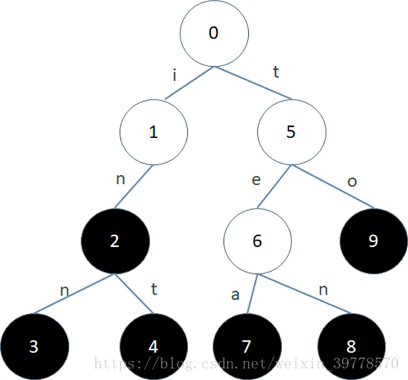
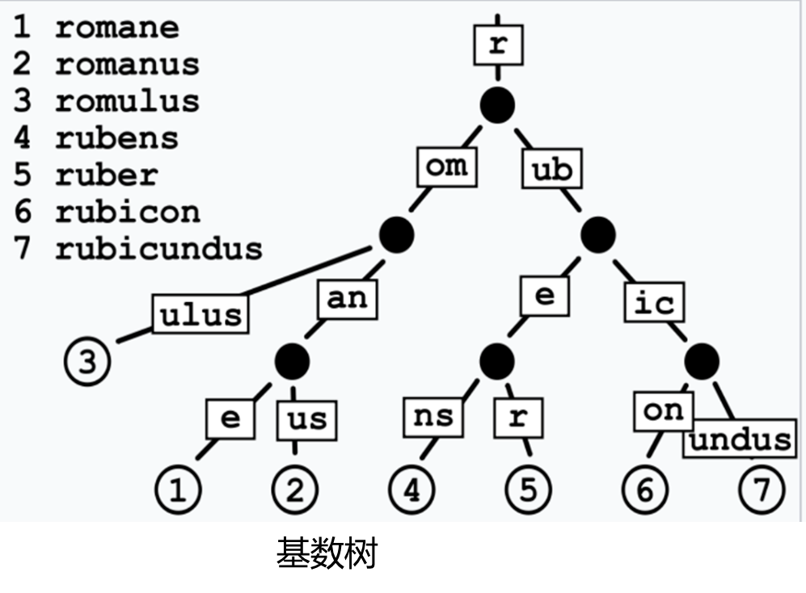
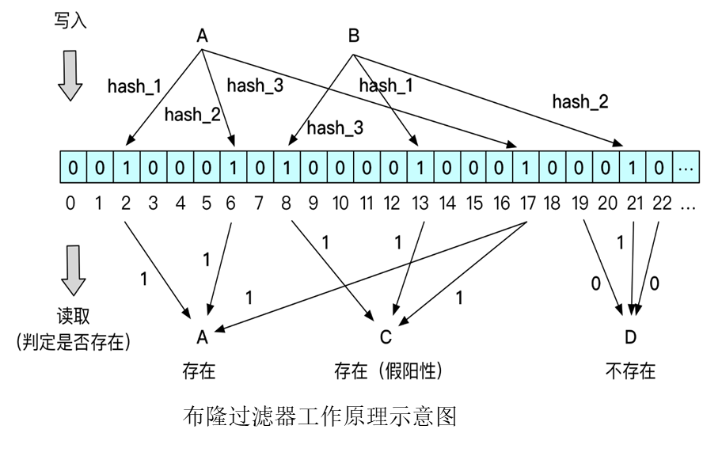

# 数据组织与存储

## 何为数据组织

数据组织是基于存储硬件访问模型或底层数据组织模型，对上提供高级数据组织模型的访问接口

数据组织带出了两个问题，即数据映射问题和数据放大问题

### 数据映射

数据映射是指逻辑数据与物理数据存储位置之间的映射关系，这就需要附加额外的信息进行实现，譬如元数据，索引，日志等。由此产生了数据放大问题

### 数据放大

#### 数据存储量的放大

- 元数据：这是描述数据的数据，主要包括存储位置，数据属性等
- 索引：为了加快数据查找设立的数据结构
- 日志： 日志是用户操作和新增或更新数据的记录，一般采用追加写的方式，常用于保证数据的一致性和事务的原子、持久性。
- 冗余：出于可靠性保障、或提高并行访问性能的目的，系统中会存储冗余数据。

#### 数据访问量的放大

- 读放大：增加了扫描操作获取数据
- 写放大：更新时索引和冗余（数据副本）需要同步更新

#### 优化思路

- 基于硬件特性的优化
- 数据更新时不做原位置更新，而是追加写入新副本。不进行原位更新的策略可以优化写放大的原因主要包括以下几点：

  1. **顺序写入的优势**：追加写入通常是顺序的，这种方式比随机写入更高效。顺序写入有助于减少磁盘寻道时间，从而提高整体写入速度，降低写放大效应。

  2. **批量合并操作**：在数据更新过程中，可以将多个更新操作合并为一次大的写入，减少写入次数。这样可以在合并过程中优化数据结构，降低写入总量，进而减轻写放大现象。

  3. **延迟更新和合并策略**：通过将更新的数据存储在内存中，只有在合适的时机才进行合并和写入磁盘，减少了频繁的写操作，降低了每次写入的负担，从而减少写放大。

#### RUM原理

RUM原理（Read-Update-Memory）在处理数据存储时，面临着在读放大、写放大和存储放大这三个方向中的权衡，最多只能优化两个方向。具体来说：

1. **读放大**：
   - 指在读取数据时，实际读取的数据量超过了请求的数据量。

2. **写放大**：
   - 指在写入数据时，实际写入的数据量超过了原始数据量。因为更新数据同时需要对日志索引等辅助数据进行更新。

3. **存储放大**：
   - 指存储的辅助数据（日志，索引等）引起额外的空间开销

在RUM原理中，通常的优化策略是：

- **如果优化读放大和写放大**，则可能会导致存储放大，因为需要维护多个版本和合并操作的频繁执行可能导致额外的存储需求。
  
- **如果优化写放大和存储放大**，则可能会牺牲读取性能，导致读放大，因为合并和压缩操作可能使得读取最新数据时需要更多的计算和I/O操作。

- **如果优化读放大和存储放大**，则可能会牺牲写入性能，导致写放大，因为可能需要频繁更新和管理多个版本的数据和索引。

## 索引技术

### 哈希索引

- 优点：简单、易行，定位到目标数据的复杂度是O(1)
- 局限：主要用于支持单点查询，无法加速范围查询
- 哈希冲突问题及其解决方法：
  - 链地址法、线性探测法、布谷鸟哈希； 
  - 降低哈希冲突的原则：
    - 优化哈希函数；
    - 以空间换时间。

### 有序索引

#### $B/B^+$树

B树是在二叉树的基础上通过增加分支达到减少深度的效果，通过节点的分裂与合并保持树的平衡。B+树是基于B树的一种结构，其非叶子节点不保存数据，所有数据在叶子节点且按照顺序链接。

#### 跳跃表

通过多层链表的方式实现类似于B树功能的结构，不同层链表跨越数据项的个数不同。查询时先通过粗粒度的链表快速定位，然后逐渐向下更细粒度的链表搜索，直至找到或者对底层结束搜索。

#### WOI:(Write-Optimized Index)

特点：

- 在一定程度上打破了有序索引完全有序的设定，允许一定程度的局部无序，从而可以减少为了维护完全有序带来的实际写操作，但是也带来了读操作的性能下降
- 不进行原位置更新，可以减少性能较差的随机写操作，以连续写操作为主，从而优化了写放大

##### $B^\epsilon$树

- 将B树的每个结点空间分为两部分，一部分仍按原有功能设计，存储关键字和指向下层结点的指针，而另一部分空间是缓冲区。
- 数据先有限缓存在当前结点的缓冲区中，采用追加写的方式，减少了原位更新，只有当缓冲区已满时才会将缓冲区的内容批量传递给下层结点。缓冲区的追加写，导致了查找时开销的增加。
    ↓
- $B^𝜀$树相对于B树的读性能有所下降，写性能提升，通过调节结点内两部分的空间比例，可以在读写性能之间权衡。

##### LSM（日志合并）树

结合B树的结构，采用日志内容的树形结构，延迟更新、批量写入。LSM树数据分为多个层次组织，每个层次内部是一种有序结构。数据量逐层增大，上部数据量小的层会位于内存中，下层数据量大的层位于外存

- 写数据：
  - 收到写请求，先把该条数据写到WAL Log，用作故障恢复
  - 写完WAL Log后，把该条数据写入内存的SSTable中（删除对应墓碑标记，更新对应新记录一条的数据）
  - 当Memtable超过一定的大小后，会在内存里面冻结，变成不可变的Memtable，同时为了不阻塞写操作需要新生成一个Memtable继续提供服务
  - 把内存中不可变的Memtable给dump到硬盘上的SSTable层中，此步骤称为Minor Compaction
  - 当磁盘上每层的SSTable的体积超过一定的大小或者个数，也会周期性的合并，此步骤称为Major Compaction（该步骤会真正的清除掉被标记删除的数据以回收空间）
- 查询数据：
  - 收到读请求先在内存当中查询
  - 没有查询到则依次下沉，直到最坏情况下把所有的层查询一遍得到最终结果

#### 前缀树

##### 字典树

键不直接保存在结点中，而是由结点在树中的位置决定，一个结点的所有子孙有相同的前缀，根节点为空。可以较大限度减少无谓字符串比较，可用于词频统计和大量字符串排序。

##### 基数树

在Trie树基础上进行适当的压缩，如果某结点是唯一子树，就和父结点合并

### 哈希+存在索引--Learned Index

- 设计思想：首先引入决策树的思想，把任务分解，每层的任务变简单，同时也方便实现混合模型。RM-Index是一种递归回归模型，将整个预测过程划分成多个Stage，每一个Stage的Model基于Key作为Input，然后选择下一个Stage所对应的Model，依次递归，直到最终的一个Stage能够预测出Key的数据位置（在限定的误差范围内）
- 训练过程：
  - 固定整个 RM-Index 的结构，包括层数、每层 Model 数量等
  - 用全部数据训练根节点，然后用根节点分类后的数据训练第二层模型，再用第二层分类后的数据训练第三层
  - 对于第三层（叶节点），如果最大误差大于预设的阈值，就换成 B 树

### 存在索引

功能弱化，只回答目标数据是否在待查询集合中，不能精确定为存储位置。布隆过滤器（Bloom Filter）：节省空间，不是100%准确，经常和其他索引配合。如果全局索引能将目标定位到具体某个部分，则不需要布隆过滤器。但如果没有全局索引，或全局索引不够精确而只能定位到多个候选部分时，每个部分设置一个布隆过滤器可减少无效数据访问。

