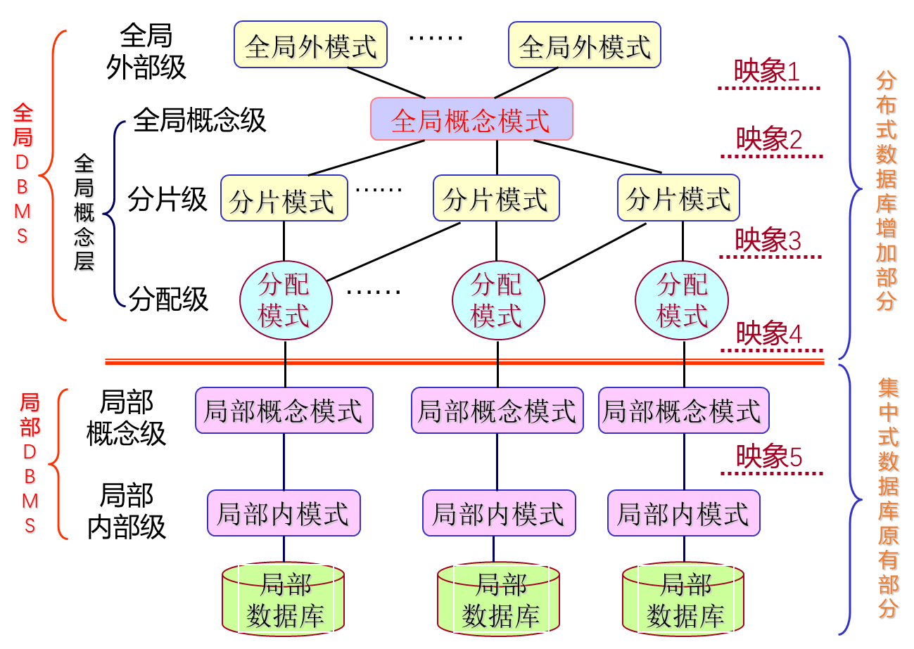

# 分布式数据库体系结构

## 分布式数据库体系结构概述

### 分布式数据库体系结构需求

- 数据分布存储
- 异构环境中数据集成的需求（异构数据指的是不同数据库当中存储的数据格式不同）
- 数据库设计方案信息系统集成的需求

### 分布式数据库体系结构系统技术特色

- 拓展了数据独立性：除了逻辑独立性和物理独立性，还具备数据分布独立性（数据分布独立性是分布式数据库系统中特有的一种独立性，它允许数据在不同的物理位置进行分布存储，而不影响用户的访问。）
- 集中与自治相结合的数据结构：局部DBMS可独立自治的管理局部数据库；系统也设有集中控制机制以协调各局部DBMS的工作，从而完成全局应用。
- 适当增加了数据冗余度：通过适当增加数据冗余可以方便检索，减少通信代价，提高系统的查询速度。（数据冗余即相同的数据可以在多个节点上存在副本）
- 全局的一致性：可串行性和可恢复性

### 分布式数据库体系结构系统模式结构

分布式数据库系统的模式结构主要包括以下几个层次：

1. **全局外模式（Global External Schema）**：
   - 这是最终用户或应用程序所看到的数据库视图，代表了全局应用的视图。全局外模式是全局概念模式的一个子集，它为用户提供了一个统一的数据访问接口，隐藏了数据的物理分布细节。

2. **全局概念模式（Global Conceptual Schema）**：
   - 定义了分布式数据库中数据的整体逻辑结构，使得数据在逻辑上看起来像一个没有分布的单一数据库。全局概念模式通常采用关系模型，并包括一组全局关系的定义。

3. **分片模式（Fragmentation Schema）**：
   - 描述了如何将全局关系划分为多个逻辑片段（Fragment），以及这些片段之间的映射关系。分片模式可以是一对多的，即一个全局关系可以对应多个片段，而一个片段只来自一个全局关系。

4. **分布模式（Allocation Schema）**：
   - 定义了片段在物理上的存储位置，即哪些片段存放在网络的哪些节点上。分布模式的映像类型决定了分布式数据库是冗余的还是非冗余的。如果一个片段可以分配到多个节点上，则是冗余的分布式数据库；如果一个片段只分配到一个节点上，则是一个非冗余的分布式数据库。

5. **局部概念模式（Local Conceptual Schema）**：
   - 描述了分布式数据库中局部数据的逻辑结构，是全局概念模式的子集。每个局部数据库系统都有自己的局部概念模式，用于描述和管理本地存储的数据。

分布式数据库系统中的映像包括：

- **从全局概念模式到分片模式的映像**：这个映像定义了全局关系如何被划分为片段。
- **从分片模式到分布模式的映像**：这个映像定义了片段如何被分配到网络的不同节点上。
- **从分布模式到局部概念模式的映像**：这个映像把存储在局部场地的全局关系或全局关系的片段映像为各局部概念模式。

数据独立性在分布式数据库系统中的体现：

- **逻辑独立性**：用户的应用程序与数据库的逻辑结构无关，即改变数据库的逻辑结构不会影响到应用程序。
- **物理独立性**：用户的应用程序与数据库的存储结构无关，即改变数据库的存储结构不会影响到应用程序。
- **数据分布独立性（分布透明性）**：用户不必关心数据的物理分布细节，包括数据的逻辑分片、物理位置分布、重复副本的一致性问题等。这种透明性使用户能够像操作本地数据一样操作分布式数据库中的数据，而无需关心数据的具体存储位置和分布情况。

分布式数据库系统通过这种多层次的模式结构和映像机制，实现了数据的分布透明性，使得用户可以像使用集中式数据库一样使用分布式数据库，而无需关心数据的分布和复制等细节。
