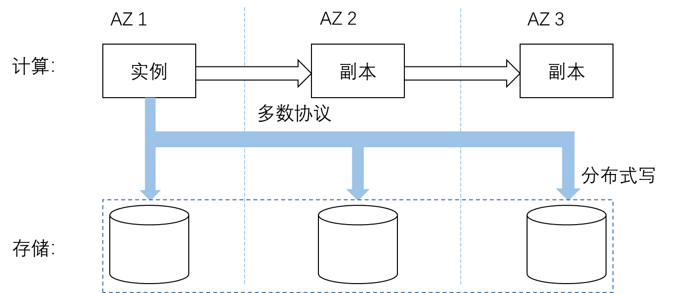

# 大数据管理系统实例分析

## Aurora 关系数据库

亚马逊公司的关系数据库系统Aurora，是亚马逊云平台上的企业级数据库系统，具有高扩展、高可用等特性。其最大的特点在于计算和存储节点的分离

- 读操作：从实例和实例的副本都可以进行读取。在多数协议下，必须至少读取$V_r$个副本
- 写操作：只能从实例向存储进行写入。多数协议下，至少写$V_w$个副本。
- 当$V_r + V_w > V$的时候能够保证读操作一定读取到最新的数据。例如，如果总共有5个副本（$V=5$），并且至少需要从3个副本中读取（$V_r=3$）和至少写入3个副本（$V_w=3$），那么$V_r + V_w = 6 > V$，这保证了读操作可以读取到最新的数据。
- 当$V_w>V/2$的时候能够消除写冲突。例如，如果总共有5个副本（$V=5$），并且至少需要写入3个副本（$V_w=3$），那么$V_w > V/2$，这有助于确保即使部分副本不可用，写操作仍然可以成功。

## SpannerDB

Google提出了全球级的分布式数据库Spanner，其扩展性可达到全球级的数百万节点，数以百计的数据中心，上万亿的行，支持数据的同步和复制，且能在保证效率的基础上进行数据复制。

### 数据模型

Spanner的模型属于半关系型模型，数据库根据客户端分割为一个表或者多个表的层次结构，类似于传统关系数据库中一对多关系。该层次结构的上层的表是一个目录表，目录表中每行都具有键Key，和子孙表中的所有以Key开始(以字典顺序排序)的行一起，构成了一个目录。

#### 目录

Spanner定义了一种在一系列键值映射上的桶抽象，称为 “目录（directory）”，它是包含公共前缀的连续key的集合。一个目录是数据放置的基本单元，同一个目录的所有数据都具有相同的副本配置。数据迁移时，在不同的Paxos组之间以目录为单位移动。

#### Spanner表

表和关系数据库表类似，具备行、列和版本值。每个表有包含一个或多个列的主键，主键形成了行的名称，每个表都定义了从主键列到非主键列的映射。

### 与BigTable对比

#### 相似

- 管理的spanserver类似Bigtable中的tabletserver
- spanserver中的数据结构也是类似tablet的结构
  
#### 差异

- 时间戳字段不再是Key的一个组成部分，而是单独作为一个独立项，从而构成了一个多版本的数据库