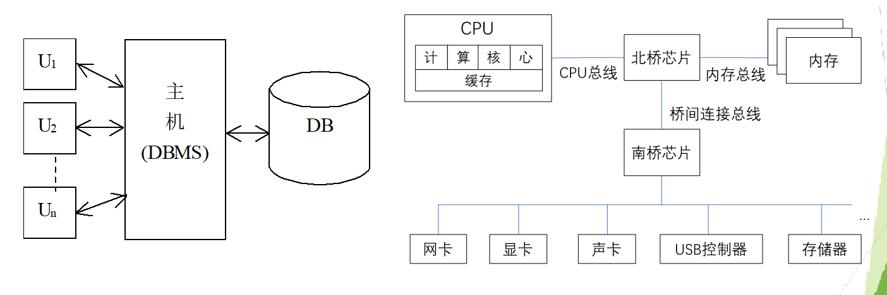
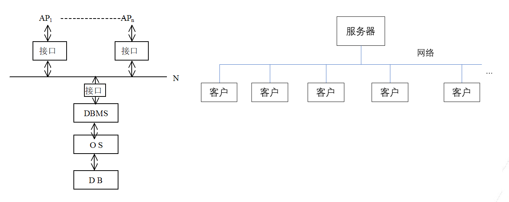
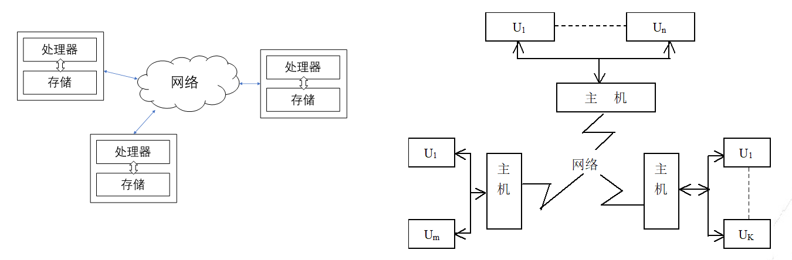
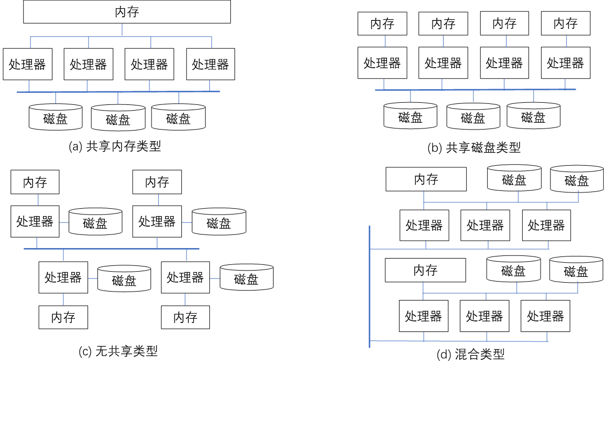

# 数据库系统体系架构分类

发展动力：需求驱动，硬件推动，数据软件规模增大，软件系统分工分层的设计

## 集中式体系架构

### 优势

结构简单，资源共享性高，数据易于管理和维护

### 劣势

主机负担重，可靠性弱，用户端缺乏数据处理能力

### 演变

现代的集中式体系架构一般具有多个计算核心，具有并行性

集中式体系架构的并行性（事务处理的并行），可分为两种：

#### 粗粒度并行

较为常见，不同的计算核心处理不同的事务，基于增加整体吞吐量提升系统性能，但没有提升每个事务的处理时间。

#### 细粒度并行

为了完成一个事务运用了多个处理器线程共同运行，通过降低每个事务的处理时间提升整体系统性能。

## 客户-服务器体系架构

客户-服务器体系架构：由一个节点作为服务器，其他节点作为客户，客户通过网络和服务器节点进行连接的体系架构。 数据库系统分为前后端，显示、报表生成多部署在前端；数据访问、并发控制、故障恢复等多部署在后端

### 优点

负载相对均衡，效率提高；吞吐率有所提高，开放性好

### 缺点

Database访问瓶颈，服务器负担重

## 前两个架构的区别

客户-服务器体系架构和集中式体系架构是两种不同的计算模型，它们在结构、功能分布、资源共享、数据管理、可扩展性等方面有显著的区别。以下是这两种体系架构的主要区别：

1. **结构和功能分布**：
   - **集中式体系架构**：在这种架构中，所有的数据处理和存储都集中在一个中央计算机（主机）上。客户端通常没有数据处理能力，只负责输入和显示数据。
   - **客户-服务器体系架构**：这种架构由多个计算机组成，其中一个或多个服务器节点负责数据处理和存储，而客户节点可以有不同程度的数据处理能力。客户和服务器通过网络连接，客户向服务器发送请求并接收数据。
2. **资源共享**：
   - **集中式体系架构**：资源共享性高，因为所有的处理和数据都由主机完成，但这也意味着主机的负担很重。
   - **客户-服务器体系架构**：资源可以更灵活地共享，因为不同的任务可以分布在多个服务器和客户机上，这有助于负载均衡和提高效率。
3. **数据管理**：
   - **集中式体系架构**：数据管理和维护相对简单，因为所有的数据都存储在一个地方，但也更容易出现单点故障。
   - **客户-服务器体系架构**：数据管理更复杂，因为数据可能分布在多个服务器上，需要更复杂的数据一致性和备份策略。
4. **可扩展性**：
   - **集中式体系架构**：扩展性有限，因为所有的处理能力都依赖于单个主机的性能，增加更多用户或处理需求可能导致性能瓶颈。
   - **客户-服务器体系架构**：更容易扩展，可以通过增加更多的服务器节点来提高处理能力和存储容量，从而满足不断增长的用户和数据处理需求。
5. **可靠性和容错性**：
   - **集中式体系架构**：可靠性较弱，因为主机的故障会导致整个系统的瘫痪。
   - **客户-服务器体系架构**：可以通过在多个服务器上复制数据和使用故障转移机制来提高系统的可靠性和容错性。
6. **网络依赖性**：
   - **集中式体系架构**：不需要网络连接，因为所有的处理都在本地完成。
   - **客户-服务器体系架构**：严重依赖网络，网络的稳定性和性能直接影响整个系统的性能和可用性。
7. **成本和复杂性**：
   - **集中式体系架构**：初期投资可能较低，因为只需要一个强大的中央计算机，但随着系统扩展，维护和升级成本可能很高。
   - **客户-服务器体系架构**：初期可能需要更高的投资来建立网络和多个服务器，但长期来看，由于其灵活性和可扩展性，可能会有更低的总体拥有成本。

总的来说，客户-服务器体系架构提供了更高的灵活性、可扩展性和可靠性，适合于需要处理大量分布式数据和请求的现代应用。而集中式体系架构则在某些特定场景下，如小型或简单的数据处理需求中，可能更为适用。

## 分布式与并行架构

### 分布式架构

分布式体系架构是指各计算设备分离，通过网络完成设备之间的交互和通信的体系架构。

#### 优点

- 能够实现自治和协调
- 数据分布式存储实现了异地数据访问
- 可以设置数据副本和容错机制能够保证系统的高可用性
- 可以通过灵活定制的分布策略保证负载均衡
  
#### 缺点

- 副本的复制和同步，分布式食物的提交和并发控制等问题会导致结构与管理复杂
- 协调过程离不开网络，导致效率会受到网速的限制

### 并行体系架构

