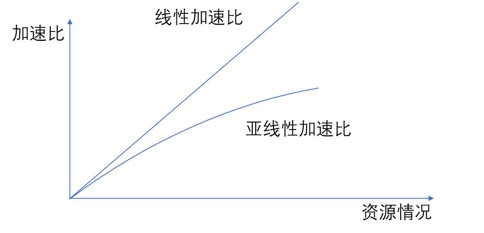
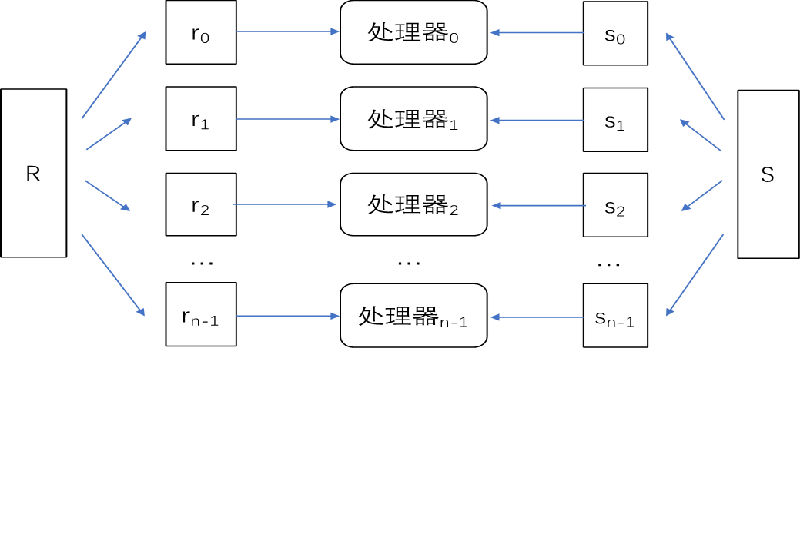
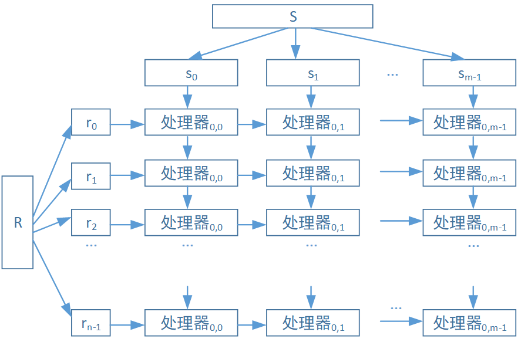

# 并行数据库体系架构

## 相关术语

### 服务器的分类

- 事务型服务器：接受客户端查询请求，将结果返回客户端
- 数据型服务器：客户端通过接口访问服务器数据，可提供页（page）、元组（tuple）、对象（object）粒度的修改。

### 重要的性能指标

- 加速比：同一个任务在单处理器系统和并行处理器系统中运行消耗的时间的比率
- 扩展比：同时增加需要处理的问题规模和资源，计算相比于基准处理时间的比值

在理想情况下，并行处理系统的加速比应当是线性加速比，既处理器资源越多，处理时间越短，加速比线性增长。而实际上通常表现出亚线性加速比，具体原因可能来自一下几个方面：

- 处理器增多，通信开销增大，有一部分时间消耗在了通信上面
- 处理器负载不均衡，先完成的任务有时需要等待必要的数据资源才能继续进行，导致加速比不是线性的
- 处理器的内存可能不够任务需要，访问磁盘的IO导致加速比成为亚线性

而比线性加速比更好的是超线性加速比，下面两种情况可能出现：

- 第一种情况是单处理器执行时，cache不能完整存下所有数据，访问磁盘的IO导致耗时很高，并行时随着处理器增加，数据能够完全存放到cache当中，访存速度大大增加，导致超线性加速比的出现。
- 第二种情况时程序算法的设计，比如在并行搜索的时候，多起点搜索可能很快找到了需求点，程序搜寻遍历的点数往往少于单处理器顺序搜索，也会出现超线性加速比。

## 并行体系架构

### 并行数据库出现的原因

- 具有多计算核心的处理器普及
- 数据体量大规模增长
- 数据库查询的集合操作适合并行处理

### 并行体系架构的设计

#### 数据存储访问的并行化

- 循环划分：均等地把元组存储在多个磁盘，适合全表扫描查询
- 散列划分：根据hash值把数据映射到磁盘上，适合点查询（查找特定值）
- 按范围划分：根据关系某个属性值的不同范围划分（容易出现数据偏斜）（适合划分属性商店范围查询）

#### 查询操作的并行化

##### 查询间并行

单个事务响应时间不变，但能有效提升系统的事务吞吐率（单位时间内完成的事务数量）。需要注意保证缓存一致性，同时要进行事务冲突和并发控制，不同处理器之间需要通信，需要设计锁和日志。

#### 查询内并行

一个查询往往可以分解成为多个操作，通过操作间并行和操作内并行的方式实现查询内并行。

- 操作间并行：分为流水线并行和独立并行。
  - 流水线并行：类似重叠执行，不需要等上一步完全做完，产生输出就扔给下一步。不适合所有运算，且个步骤时间可能不均匀，加速效果有限。对于三个关系的连接操作，操作间并行只能选择流水线并行，先计算R1与R2连接，结果作为下一步Result和R3连接的输入。而至于像集差的运算，是不适合流水线并行的，因为在流水线并行中，每个阶段的输出大小通常是预先知道的，这有助于流水线的稳定运行。然而，集差运算的输出大小是不确定的，因为它取决于两个输入集合的重叠部分，这种不确定性使得流水线难以优化和平衡。
  - 独立并行：互不依赖的操作独立执行。比如四个关系的连接可以先执行R1R2连接，R3R4连接，再把两者的输出进行连接
- 操作内并行：对数据进行划分，并行执行相同的操作后再连接（类似归并排序）
  - 划分连接：将参与连接的两个关系R和S（针对连接条件）用相同的方式划分为n份，使得划分后的$r_i$和$s_i$处于同一个范围，$r_i \& s_j （i≠j）$之间的元组不满足连接条件，之后将各自的n个划分交给n个对应的处理器并行执行连接操作。
  - 分片-复制连接:参与连接的两个关系R和S，可以（在连接属性上）分别按照不同的划分函数分片，处理器i，j只需负责处理R的第i分区和S的第j分区的数据的连接，从而并行操作。
  - 并行散列连接:partition、build和probe阶段。partition阶段将R表的数据划分到不同的分区上，build阶段在各个分区上构建哈希表，probe阶段先将S表中的元组映射到对应的分区上，再进行连接操作。
    - 非阻塞分区：非阻塞式分区只扫描一遍关系表R。对于每个元组，计算好该元组所在的分区后，直接将数据写入该分区。。Build阶段只关心hash表的产生，对于它输入的数据是否是完整的并不关心。此种方法只扫描一次输入关系并即时生成输出，通过另外的线程去读取输入产生的hash表等结果，从而不必要等到所有的线程都结束扫描再进入下一个阶段。
    - 阻塞分区：阻塞式分区在执行过程中需要多次扫描关系表R。首先，它计算每个分区的大小，以及所有元组所在的分区，然后统一将数据写入对应的分区。多步骤传递数据：首先扫描R并计算每个哈希键的元组数量的直方图在某个偏移量处的基数。接着使用此直方图通过计算前缀和来确定输出偏移量。最后再次扫描R并根据散列键进行分区。由于需要预先计算分区大小并分配空间，这个过程通常需要等待所有分区准备就绪，因此阻塞了后续操作的执行。
  - 嵌套循环连接
