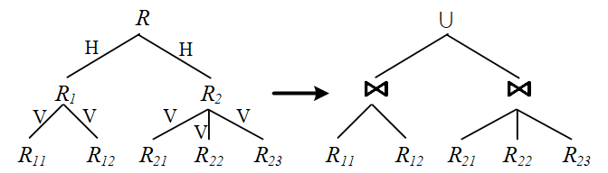

# 分布式查询处理优化

## 概述

### 基本的数据分布策略

#### 数据分片

分片是将分布式数据库的全局数据逻辑划分为关系片段并且进行实际的物理分配的过程。不同的分布式系统有着不同的分片策略。

- 关系数据库主要通过数据分片技术对全局数据进行逻辑划分和实际的物理分配。考虑的主要因素：数据的模式特征、查询负载特征、数据量特征
- 分布式文件系统中，文件被分成固定大小的块，由分布式文件系统负责数据块的分布式存储和复制，为用户提供具有高容错性、高伸缩性的海量数据分布式存储

这张图展示了分布式数据库中三个关系表（SUPPLIER、LINEITEM 和 PART）的数据分片与复制策略。具体说明如下：

1. **关系表**：
   - SUPPLIER 
   - LINEITEM 
   - PART 

2. **分片与复制策略**：
   - 数据被分布到三个节点（节点 1、节点 2、节点 3）上。
   - 每个节点存储不同的数据组合，通过分片和复制来提高数据的可用性和查询性能。

3. **各节点数据分布**：
   - **节点 1**：包含 `L1`（LINEITEM 表的记录）、`S1`（SUPPLIER的记录）和 `P1`（PART 表的记录）。
   - **节点 2**：包含 `L2`、`S1`（SUPPLIER 表的副本）以及 `P1`、`P2`（PART 表的记录）。
   - **节点 3**：包含 `L3`、`S1`（SUPPLIER 表的副本）和 `P2`。

4. **分片策略**：
   - LINEITEM 表进行了分片处理，不同的记录分布在不同节点上：`L1` 在节点 1，`L2` 在节点 2，`L3` 在节点 3。
   - PART 表也进行了分片处理，`P1` 分布在节点 1 和节点 2，而 `P2` 分布在节点 2 和节点 3。

5. **复制策略**：
   - SUPPLIER 表的 `S1` 记录在三个节点上都有副本，这样可以提高数据的可用性和读取效率。

策略解读

- **数据分片**：通过将不同记录分布到不同的节点，实现了水平分片。这种方式可以分散查询负载，减少单节点的压力。
- **数据复制**：包括关键数据（如 SUPPLIER 表的 `S1` 记录）在多个节点上有副本，以及PART表分片进行了部分复制以增强数据的容错性和可用性。这样即使某个节点故障，数据仍可从其他节点获取。
- **性能优化**：这种组合的分片和复制策略有助于在分布式环境中实现高可用性和负载均衡，从而提升查询性能和系统可靠性。

##### 分片的好处

- 支持了数据库存的可扩展性
- 不同场地的数据库分片支持并行查询处理
- 优化的分片策略可以提高节点上查询处理的局部性（譬如之前Supplier表每个节点都有一个副本）降低网络通信延迟
- 分片的副本机制提高了可靠性和容错能力

### 分布式查询处理

代价模型：$C_{Total}=C_{CPU}+C_{I/O}+C_{COM}$
即计算成本+输入输出成本+分布式节点通讯成本
其中通讯成本$C_{COM}（X）=C_{Latency}+X/C_{I/Obandwidth}$
$X$是传输数据量，后一个表达式是数据量/带宽

### 分布式查询优化

- 选择、投影等一元操作：主要采取集中式数据库相同的存取访问优化技术；
- 连接操作：涉及跨节点数据访问，比较复杂。面向分布式系统的连接操作查询优化方法大致分为：基于连接的优化和基于直接连接的优化。

## 面向关系型数据的分布式查询处理

### 分片策略

#### 水平分片

原理：通过选定一个分片键（通常是主键或具有较高查询频率的字段），根据该键的值将数据分配到不同的分片中。例如，可以按照用户 ID 或订单 ID 的范围进行分片。

##### 基本水平分片

**定义**：  
基本水平分片是直接按照一个主表的分片键（通常是主键或某个高频查询字段）对数据进行分割，将数据行均匀地分配到不同的分片中。

**特点**：  

- **分片依据**：根据主表的某个字段（如主键或其他唯一标识）直接进行分片。
- **分片范围**：各个分片之间通常是独立的，每个分片只存储一部分数据行。
- **实现方式**：可以通过范围分片（如 ID 的范围）或哈希分片（如 ID 哈希值）来决定每行数据应该放置在哪个分片中。
- **示例**：一个 `User` 表可以按用户 ID 的范围分成 `User_1`、`User_2`、`User_3` 三个分片，分别存储不同范围的用户数据行（例如：ID 1-1000、1001-2000 等）。
  
**使用场景**：  
适用于主表需要进行高频查询的情况，查询可以直接定位到某个分片，从而减少查询的范围，提升查询效率。

##### 导出水平分片

**定义**：  
导出式水平分片是基于基本水平分片的结果，对其他关联表进行分片的一种方式。即，导出式水平分片依赖于主表的分片规则来决定关联表的分片方式。

**特点**：  

- **分片依据**：从属于主表的分片规则。导出表的分片规则基于主表的分片键（通常是外键）来确定。
- **分片范围**：导出表的分片方式与主表保持一致，以便实现局部性查询（即分片后的关联数据可以在同一分片上完成查询）。
- **实现方式**：导出表按照主表的分片方式进行同样的水平分片，这样在执行关联查询时，可以避免跨分片查询。
- **示例**：假设 `Order` 表（订单表）与 `User` 表（用户表）有一对多关系，且 `User` 表按 ID 水平分片。导出式分片将 `Order` 表也按照 `User` 表的分片规则进行分片（即基于 `UserID` 进行水平分片）。这样，属于同一个用户的订单数据将分配到与该用户数据同一分片中。

**使用场景**：  
适用于关联表之间存在较强的关联关系，且需要频繁进行联合查询的情况。通过导出式分片，可以将关联数据放在相同的分片中，避免跨分片访问，从而提升查询性能。

##### 区别总结

| 特性            | 基本水平分片                       | 导出式水平分片                       |
|-----------------|-----------------------------------|--------------------------------------|
| 分片依据        | 主表的某个分片键（主键或高频字段） | 基于主表的分片规则，使用主表的外键   |
| 分片对象        | 单表                               | 主表及其关联的从表                   |
| 实现方式        | 按主表的分片键直接进行分片         | 依赖主表的分片规则对从表进行分片      |
| 应用场景        | 单表查询或高频查询的主表           | 需要联合查询的关联表，避免跨分片查询  |
| 优点            | 简单直接，适用于单表高频查询       | 数据局部化，减少跨分片访问，提高性能  |

#### 垂直分片

- 定义：垂直分片（也称为列分片或导出分片）是将一个关系表按列划分成不同部分，将不同部分存储在不同的节点上。
- 原理：根据表的列以及无损分解算法，将表拆分为多个子表，确保每个分片只包含该表的部分列。例如，一个用户表可能会被拆分成两个分片，一个包含用户的基本信息（ID、姓名），另一个包含用户的详细信息（ID、地址、电话）（表与表之间的交集属性是主码）。
- 优点：适合在不同子表之间分布不同的查询负载。例如，有些查询只需要读取用户的基本信息，而不需要详细信息。
- 缺点：当查询需要多个列的联合信息时，可能需要跨分片进行连接操作，从而增加了系统开销。

#### 混合分片

- 定义：混合分片是水平分片和垂直分片的组合，适用于需要更细粒度控制的复杂场景。
- 原理：先对表进行垂直分片，将其拆分为不同的逻辑部分；再对某些垂直分片结果进行水平分片。
- 优点：混合分片可以同时满足多个分片需求，适应性更强。适用于某些表结构复杂，数据量较大且查询模式多样化的系统。
- 缺点：实现和维护相对复杂，因为需要管理不同类型的分片逻辑和跨分片的查询。

#### 分片树

水平分片用集合并操作，垂直分片是关系连接操作。构建分片数步骤如下

- 将整个关系作为分片树的根节点，确定分配策略
- 将分配策略应用于数据，构建不同的分片
- 根据数据的复杂度和应用需求递归地构建深层次分片树，直到每个分片都分配到具体的物理节点
- 根据“水平分片用集合并操作，垂直分片是关系连接操作”，把关系的恢复方式记录下来

### 查询优化

- 对查询计划策略空间剪枝，启发式方法
（1）一元操作优先
（2）二元操作按它们中间关系大小排序
（3）分布式系统中用半连接取代连接
- 集中式查询优化：单一场地执行查询优化任务
- 分布式查询优化：所有场地协同制定优化执行策略
- 混合决策：一个场地制定全局执行策略，其他场地优化局部查询任务执行策略

### 网络传输优化

不同的网络**拓扑结构**对分布式查询处理策略有较大影响。

- 慢速广域网 → 最小化网络传输代价
- 高速局域网 → 基于网络通信的并行执行策略是某些场景的最佳选择

#### 并行连接+复制策略

#### 半连接操作

半连接将连接分解为多个处理阶段，可降低场地间传输代价，但增加了消息数量和本地处理代价

##### 半连接定义

在关系代数中，关系 \( R \) 和 \( S \) 在属性 \( A \) 上的**半连接**定义如下：

\[
R ⋉ S = R \, ⋈ \, ∏_A(S)
\]
\[
S ⋉ R = S \, ⋈ \, ∏_A(R)
\]

这意味着在半连接中，我们对一个关系的连接属性 \( A \) 进行投影，然后将投影结果与另一个关系进行连接。半连接操作主要用于分布式查询处理中，以减少在不同节点之间传输的数据量。

##### 半连接的性质

- **非对称性**：半连接操作**不对称**，即它不满足交换律。因此，\( R ⋉ S \neq S ⋉ R \)。
- **输出**：半连接的结果只包含第一个关系（左关系）中在第二个关系（右关系）中有匹配值的元组。

##### 使用半连接表示连接操作

关系 \( R \) 和 \( S \) 在属性 \( A \) 上的连接操作可以通过半连接表示如下：

\[
R \, ⋈ \, S = (R ⋉ S) \, ⋈ \, S = (R \, ⋈ \, ∏_A(S)) \, ⋈ \, S
\]
或等价地表示为：
\[
S \, ⋈ \, R = (S ⋉ R) \, ⋈ \, R = (S \, ⋈ \, ∏_A(R)) \, ⋈ \, R
\]

这意味着，我们可以将一个直接的连接操作分解为一系列的半连接操作，而不是直接执行完整连接，这在分布式环境中可能更高效。

##### 半连接执行步骤

1. **投影**：对右关系（例如 \( S \)）的连接属性 \( A \) 进行投影，并将投影结果发送到左关系所在位置（例如 \( R \)）。
2. **半连接**：将 \( R \) 与 \( S \) 的投影结果进行半连接，以减少 \( R \) 中只包含最终连接中需要的元组。
3. **连接**：将缩减后的 \( R \) 与 \( S \) 进行连接，得到最终结果。

##### 成本比较：直接连接 vs 半连接

是否适合使用半连接取决于**直接连接**与**半连接**的通信代价对比。在分布式数据库中，数据传输通常是瓶颈，因此减少节点间的数据传输量可以提高性能。

###### 直接连接的代价

在直接连接中，需要将整个关系 \( S \)（或 \( R \)）传输到另一个关系所在的节点。如果关系很大，这种传输代价可能会非常高。

###### 半连接的代价

在半连接中，只需将投影的连接属性（即 \( ∏_A(S) \) 或 \( ∏_A(R) \)）传输，从而显著减少了传输的数据量。然而，半连接需要对右关系进行**两次扫描**：

1. 一次扫描用于投影出连接属性。
2. 另一次扫描用于对缩减后的左关系执行连接。

##### 何时使用半连接

当以下情况时，使用半连接是有利的：

- 投影后的连接属性大小远小于整个关系的大小。
- 半连接带来的数据量减少，能够抵消掉对右关系进行两次扫描的额外成本。

总的来说，当**数据传输代价较高**且半连接操作能显著减少参与最终连接的数据量时，半连接在分布式查询处理中是有效的优化手段。

## 面向其他数据类型的分布式查询处理
