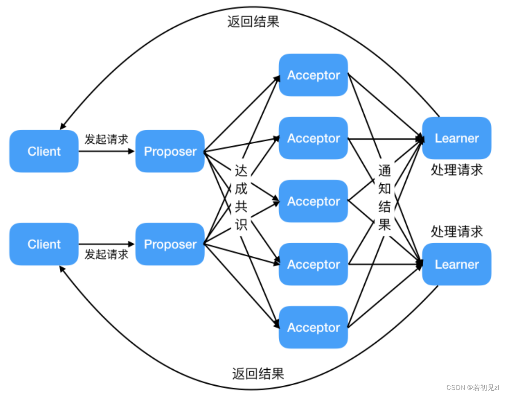
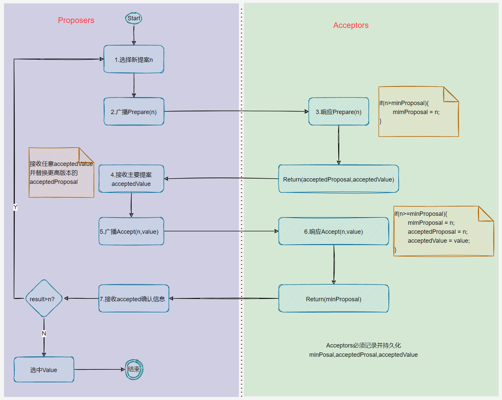
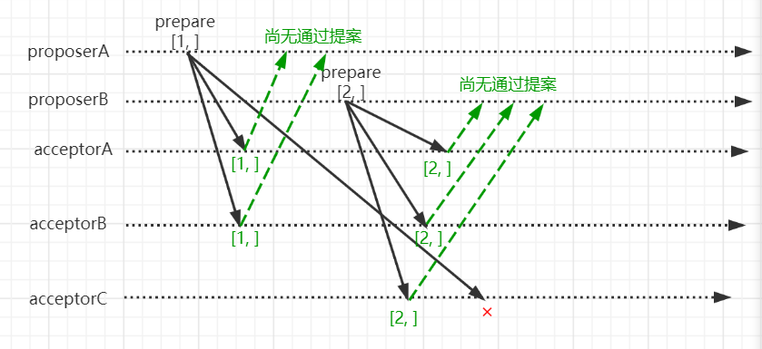
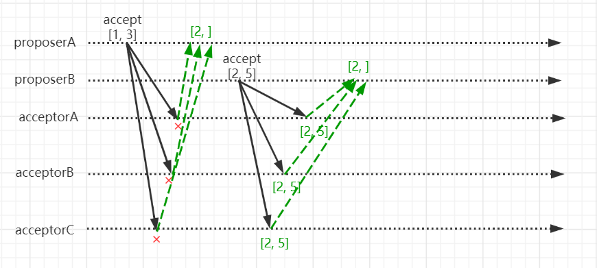
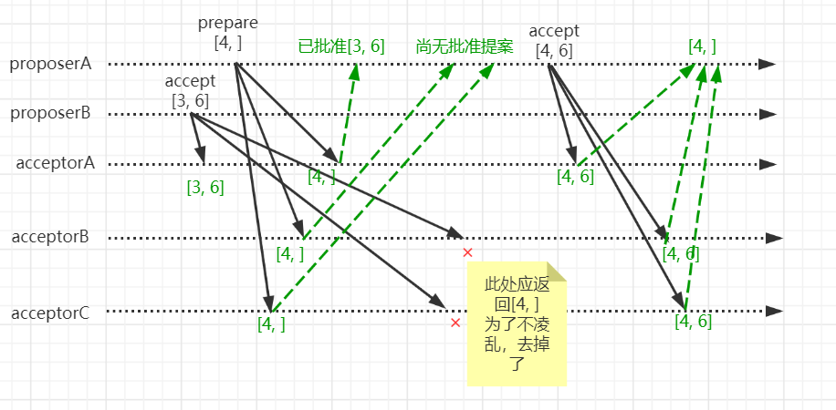
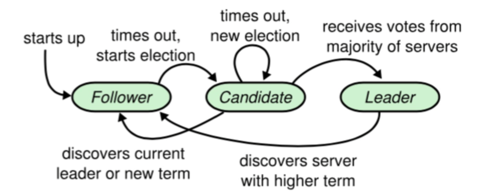

# 分布式故障恢复

大数据管理系统的故障恢复机制涉及两个关键问题：如何建立冗余数据、如何利用冗余数据恢复。

## Paxos算法

Paxos算法是基于消息传递且具有高度容错特性的一致性算法，是目前公认的解决分布式一致性问题最有效的算法之一。

### 算法当中的角色

- Proposer：提出提案 (Proposal)；可以理解为客户端，Proposal信息包括提案编号 (Proposal ID) 和提议的值 (Value)。
- Acceptor：参与决策，可以理解为存储节点，回应Proposers的提案。收到Proposal后可以接受提案，若Proposal获得多数派Acceptors的接受，则称该Proposal被批准。
- Learners：用于学习被批准的提案

### Paxos算法的主要步骤

Paxos算法可以分为两个主要阶段：准备（Prepare）阶段和接受（Accept）阶段。

1. **准备阶段（Prepare）**：
   - 一个Proposer提出一个提案编号rnd和提议的值v，并向Acceptors发送准备请求。
   - Acceptors收到准备请求后，如果它们没有响应过编号更高的请求，它们会承诺不会接受任何编号小于该提案编号的提案，并回复一个最高已接受的提案编号。

2. **接受阶段（Accept）**：
   - 如果Proposer没有收到任何编号更高的提案，它会进入接受阶段。
   - Proposer向Acceptors发送接受请求，包含提案编号和提议的值。
   - Acceptors收到接受请求后，如果请求的编号是它们承诺接受的最高编号，它们会接受这个提案，并存储提议的值。

### 集群节点如何交流数据的值

1. **提议（Proposing）**：
   - 一个节点（Proposer）想要提议一个值，它首先需要获得其他节点的同意，即进入准备阶段。

2. **承诺（Promise）**：
   - 其他节点（Acceptors）在收到准备请求后，如果同意不处理编号更低的提案，会发送承诺（Promise）响应给Proposer。

3. **接受（Accepting）**：
   - 如果Proposer收到多数Acceptors的承诺，它会进入接受阶段，向这些节点发送接受请求，包含提案编号和提议的值。

4. **学习（Learning）**：
   - 一旦一个值被多数Acceptors接受，其他节点可以通过询问Acceptors来学习这个值，从而达成一致。

Paxos算法确保了即使在部分节点故障的情况下，系统也能够达成一致。它通过多数投票机制来确保提案的值被接受，并且一旦一个值被接受，它就成为了系统的一致状态。这种机制使得Paxos算法在分布式系统中非常有用，尤其是在需要高可靠性和一致性的场景中。

### 算法流程

（1）提议者发出提案，发起一次投票，发现者接收到投票请求，将提案转发给参与者；
（2）参与者接收到投票请求后，会对提案进行投票，投票正确时发送投票确认消息；
（3）发起者收到参与者发回的投票确认消息，如果收到的投票确认消息超过半数，则发起者发出accept消息，将提案接受；
（4）参与者接收到accept消息后，如果投票正确，则发送accept确认消息；
（5）发起者收到accept确认消息后，如果收到的accept确认消息超过半数，则发起者发出commit消息，将提案接受，并执行操作；
（6）参与者接收到commit消息后，如果投票正确，则发送commit确认消息；
（7）发起者收到commit确认消息后，如果收到的commit确认消息超过半数，则发起者发出ack消息，将提案接受，并将操作结果返回给发起者；
（8）参与者接收到ack消息后，如果投票正确，则发送ack确认消息；
（9）发起者收到ack确认消息后，如果收到的ack确认消息超过半数，则发起者发出完成消息，将提案接受，并将操作结果返回给发起者，完成Paxos算法。

Paxos 算法数据的值在提案当中储存，一个提案包括提案编号和值。Accepter通过记录vrnd，即Acceptor接受的v的配套的提案编号；并且会返回接受的最大提案编号。通过提案编号和值的匹配就能以编号来进行值的交流。

### 算法模拟

为了更好的熟悉paxos，我们举例描述paxos中提案选定过程。假设存在3节点的paxos集群，这里需要注意每一个节点可以同时扮演proposer和acceptor。情况如下：
proposerA收到请求将X设置成3，proposerB收到请求将X设置成5。proposerA和proposerB分别为此生成提案，其proposerA的提案编号为1，proposerB提案编号为2。在prepare阶段它们交互结果如下

- proposerA和proposerB分别进入prepare阶段，将提案编号发给各个acceptor。
- acceptorA和acceptorB在收到proposerA的prepare请求后，由于没有通过过任何prepare请求，也没有批准过任何的accept请求。则给proposerA返回尚无提案。
- acceptorC由于在收到proposerB的prepare请求之后再收到proposerA的prepare请求，且proposerB的提案编号大于proposerA的提案编号，故不给proposerA返回prepare响应。
- acceptorA和acceptorB在收到proposerB的prepare请求后，由于之前收到proposerA的prepare请求，则比较各自的提案编号，由于proposerB的提案编号大于proposerA的提案编号，但是又没有通过任何的accept请求，则给proposerB返回尚无提案，并向proposerB保证前文所说的三个承诺。
至此，proposerA获得2个prepare响应，proposerB获得三个prepare响应。即他们都获得了大多数节点的prepare响应，于是各自开始accept阶段提交。

- proposerA由于收到的prepare响应中没有任何提案值，则自己任意设置提案值，也就是1, 3。并向各个acceptor发起accept请求。
- acceptorA、acceptorB、acceptorC收到proposerA的accept请求后，由于在prepare阶段，他们都向proposerB保证了上文所说的三个承诺，则他们不会该accept请求，并将prepare阶段通过最大的提案编号返回给proposerA，也就是2, 。
- proposerA收到2, 后，发现响应中的提案编号2比自己的提案编号1大，则认为没有accept通过该提案。proposerA需要重新回到prepare阶段进行协商。
- proposerB由于收到的prepare响应中没有任何提案值，则自己任意设置提案值，也就是2, 5。并向各个acceptor发起accept请求。
- acceptorA、acceptorB、acceptorC，在此期间没有通过任何的prepare请求也没有通过任何的accept请求，即同意批准该提案，返回2, 给proposerB。
- proposerB收到accept响应后，比对提案编号发现有大多数的提案编号是自己的编号，则认为该提案达成共识，完成协商过程。

以上过程的主要描述了accept对proposer的两个承诺，即如果acceptor通过提案M, 的准备请求

- acceptor承诺不再通过编号小于等于M的提案的prepare请求
- acceptor承诺不再通过编号小于M的提案的accept请求，也就是不再通过编号小于M的提案

那么还有一个承诺是

- 如果acceptor已经通过某一提案，则承诺在prepare请求的响应中返回已经通过的最大编号的提案内容。如果没有通过任何提案，则在prepare请求的响应中返回空值

为了描述该承诺，我们想象出这样一个场景。proposeB完成prepare请求后，发起accept请求，且提案为3, 6。在此过程中，proposeA发起prepare请求，提案编号为4, ，并且acceptor先收到proposeA发起prepare请求，也就是说acceptor会拒绝proposeB的accept请求。情况如下

- proposerB发起accept请求，提案为3, 6。
- acceptorA收到proposerB的accept请求后，批准了该请求。
- proposerA发起prepare请求，提案为4, 。
- acceptorB、acceptorC先收到proposerA的prepare请求。则拒绝proposerB的accept请求。
- acceptorA收到proposerA的prepare请求，由于之前接收了proposerB发起accept请求，则给proposeA返回已批准的提案3, 6。
- 此时，proposerB重新进入prepare协商，proposerA收到大多数prepare响应，发起accept请求，由于收到acceptorA返回的提案3, 6，那么proposer的提案值也只能为6，即4, 6。
- accept完成协商。

参考链接：https://cloud.tencent.com/developer/article/1702057

## Raft算法

### 三种角色

（1）**Leader**：领导者，接受客户端请求，并向Follower同步请求日志，当日志同步到大多数节点后，通知Follower提交日志；
（2）**Follower**：跟从者，接受并持久化Leader同步的日志，在Leader告之日志可以提交之后，执行本地的提交日志动作；
（3）**Candidate**：候选者，Leader选举过程中的临时参选者角色。

**任期（term）**：Raft算法将时间分为一个个的任期（term），每一个term的开始都代表着一次Leader选举。在成功选举出新Leader之后，新Leader会在整个term内管理整个集群。如果Leader选举失败，该term就以没有Leader而结束。

### Raft算法的主要步骤

Raft算法是一种用于管理复制日志的一致性算法，它通过选举领导者和日志复制来实现一致性。Raft算法的主要步骤可以归纳为以下几个部分：

1. **领导选举**：
   - 系统在任期内选出一个领导者（Leader），领导者负责处理所有的客户端请求并同步数据给其他副本（Follower）。
   - 初始状态下，所有节点都是Follower。
   - 如果一个Follower在指定时间内没有收到Leader的心跳消息，它将成为Candidate（候选人）并发起选举。
   - Candidate向所有其他节点发送投票请求，如果获得超过半数节点的投票支持，它将成为新一任的Leader。

2. **日志复制**：
   - Leader将客户端的请求写入日志，并将日志条目复制到所有的Follower。
   - 当这条日志条目被大多数 Followers 安全复制后，Leader 会将这条日志条目应用到自己的状态机中（commit），然后把执行的结果返回给客户端，并通知各Follower更新本地日志中的commit项。如果 Follower 崩溃或者运行缓慢或者网络丢包，Leader后续会不断重复尝试发送附加日志条目（尽管已经回复了客户端）直到所有的 Follower 都最终存储了所有的日志条目，确保强一致性。

### 如何理解Raft算法是建立在Paxos算法基础上的

- Paxos算法通过Proposer推动数据变更，允许多个Proposer存在， RaftLeader推动数据变更，合法Leader具有唯一性，直接从Leader的角度描述协议的流程，也从Leader的角度出发论证正确性。
是对Paxos思想的一个完善。
- 经典Paxos的两个阶段是无法分割的，两个阶段相互关联，共同保障了Paxos协议的一致性；RaftLeader正常时：由Leader向Follower同步日志；Leader“消失”：通过Leader选举算法选出一个新Leader，选主必须是最新、最全的日志节点才可以当选
