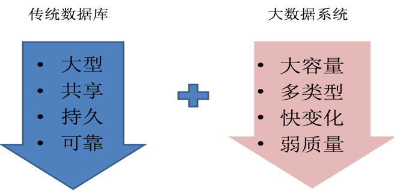
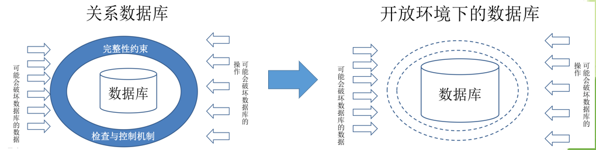
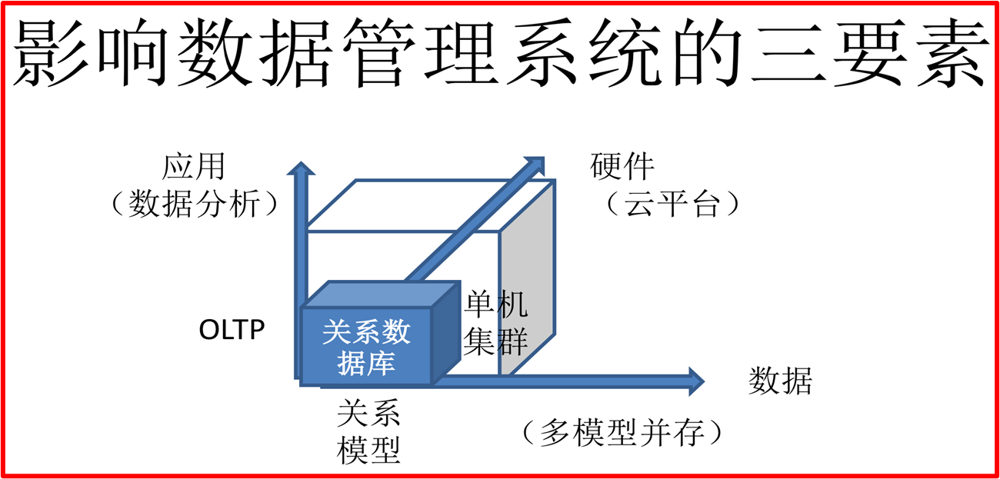
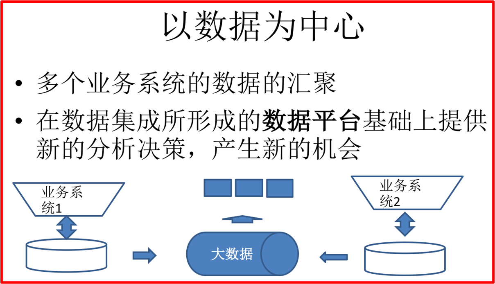
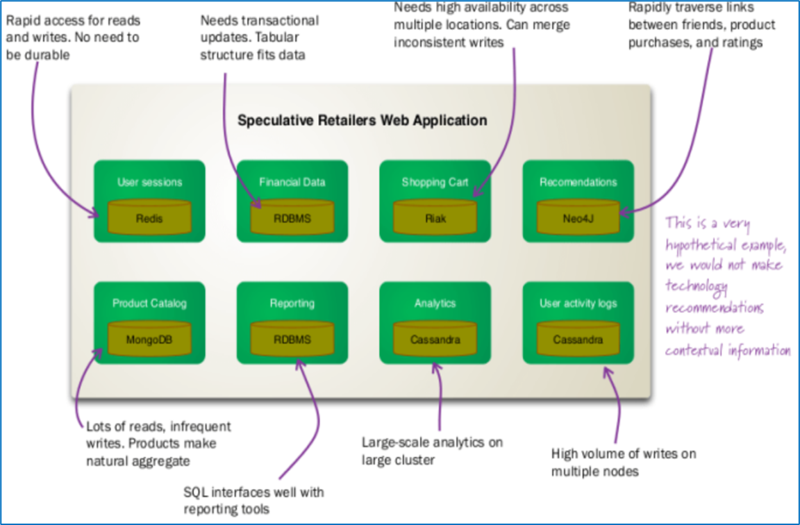
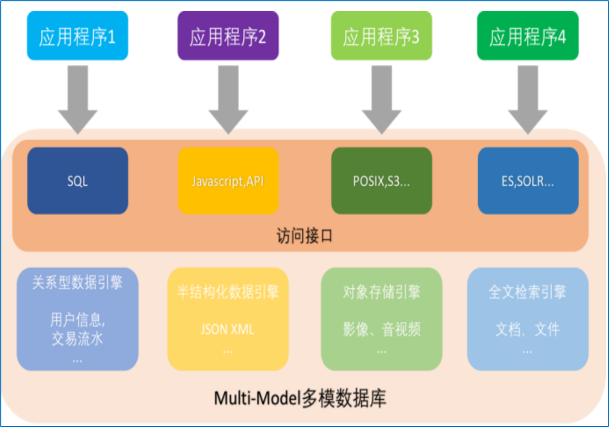

# 大数据管理系统

## 数据特征(4V)

传统数据库的定义，是大型，共享，持久，可靠，结构化数据的集合
大数据的定义是**大容量Volume，多类型Variety，变化快Velocity，质量弱Veracity**数据的集合

## 系统特征(四个变化)

- 变化1：**从封闭世界到开放世界**。传统的关系数据库遵循封闭世界假设，认为不存在数据库当中的数据都是不真实的；同时拥有预先定义好的模式，不能轻易改变；且关系代数也是一种封闭的代数系统。而大数据环境下，数据类型增加了非结构化数据，可以支持不同的数据模型；同时也没有预先确定的数据模式；数据操作可以是用户自定义的复杂操作；并且负载具有不确定性
- 变化2：**从精确数据到不精确数据**。大数据的特征之一就是质量弱。**量质融合**的大数据系统，从单一的量的管理到量质融合管理的转变

- 变化3：从数据管理到**知识管理**。关系数据库内部其实无关语义，关系、属性的语义都隐含在**数据字典的名字和关系数据中**，只有用户和程序员才能理解，数据的语义靠属性的语义来解释。大数据的存在独立性更强，数据没有外在的模式等进行语义的描述，数据很多是**自描述的**，因此如何获取并管理知识是关键问题之一。
- 影响要素：

## 应用特征

- 以对象为中心进行数据组织，实现数据汇聚
- 以机器学习为主要的应用类型
- 以社会发展第四范式--数据驱动为解决问题的新模式

## 大数据管理系统的组成

- 多引擎系统结构：支持不同数据模型的引擎将会在大数据管理系统中并存;从逻辑上实现多引擎系统的融合；对外提供统一的数据存取访问接口。
- 混合负载系统架构：大数据上存在多种不同的计算模式，例如：批计算、流计算、迭代计算、交互计算等；需要支持混合负载，在同一份数据上支持不同的计算模式。
- 分布式系统架构：大数据系统一定是分布式的系统，具有高可扩展性；一般认为，大数据系统是架构在普通服务器上的，不是高端的服务器，因此，需要分布式容错机制、高可伸缩的体系结构

数据库领域面对多类型的结构化，半结构化，非结构化数据，给出了两种解决思路：

- 混合持久化：混合持久化的思路是指，用户根据工作的不同需求分别选择使用合适的数据库，这样在一个完整的系统中，可能同时运行着多种不同的数据库

- 多模数据库引擎：在同一个数据库内有多个数据引擎，将各种类型的数据进行集中存储和使用。多个不同类型的应用，同时接入一个数据库，并在同一个分布式数据库内进行管理，大大简化应用程序的开发及后期维护成本。

