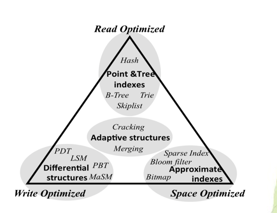
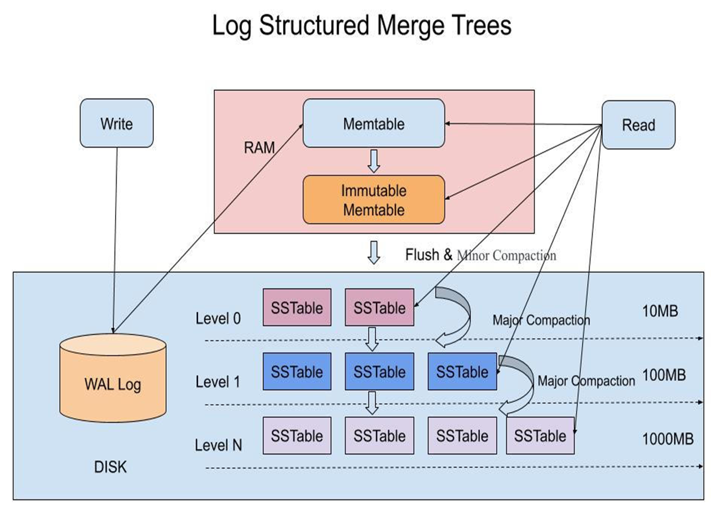
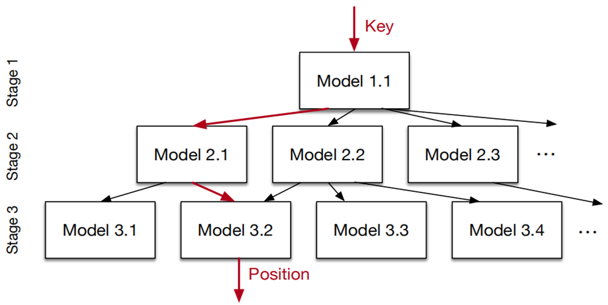

# 数据组织与存储

## 数据组织带来的数据映射与放大

### 数据映射

数据映射指的是逻辑数据与物理数据存储位置之间的映射关系，即数据布局问题。

数据布局的实现需要附加的额外信息（元数据，索引，日志，冗余等数据），然而它们带来了数据存取的新问题：**数据存储量的放大**、**数据访问量的放大**。

### 数据存储量的放大

存储和组织通常需要维护额外的信息，这些信息也需要存储空间，因此产生存储放大，即存放了除了数据以外的信息。这些信息主要有四个方面：

- **元数据**：描述数据的数据，主要包括存储位置、数据属性等，文件系统中的元数据包括超级块、文件inode、位图等等，数据库的元数据包括表格的属性、数据之间的关系等等
- **索引**：索引视为加快数据查找而设立的数据结构，例如hash表、B+树、红黑树、日志合并树、跳跃表等等
- **日志**：日志是用户操作和新增或更新数据的记录，一般采用追加写的方式，常用于保证数据的一致性和事务的原子、持久性
- **冗余**：出于可靠性保障、或提高并行访问性能的目的，系统中会存储冗余数据，可以理解成做**数据副本**

### 数据访问量的放大

1. **读放大**：
   - 指在读取数据时，实际读取的数据量超过了请求的数据量。

2. **写放大**：
   - 指在写入数据时，实际写入的数据量超过了原始数据量。因为更新数据同时需要对日志索引等辅助数据进行更新。

### RUM原理

**RUM原理**在处理数据存储时，面临着在读放大、写放大和存储放大这三个方向中的权衡，最多只能优化两个方向。

在RUM原理中，通常的优化策略是：

- **如果优化读放大和写放大**，则可能会导致存储放大，因为需要维护多个版本和合并操作的频繁执行可能导致额外的存储需求。
  
- **如果优化写放大和存储放大**，则可能会牺牲读取性能，导致读放大，因为合并和压缩操作可能使得读取最新数据时需要更多的计算和I/O操作。

- **如果优化读放大和存储放大**，则可能会牺牲写入性能，导致写放大，因为可能需要频繁更新和管理多个版本的数据和索引。

## 索引技术

### WOI:(Write-Optimized Index)

特点：

- 在一定程度上**打破了完全有序**的设定，允许一定程度的**局部无序**，从而可以**减少**为了维护完全有序带来的实际**写操作**，但是也带来了**读操作的性能下降**
- 不进行原位置更新，可以**减少性能较差的随机写操作**，以连续写操作为主，从而优化了写放大

典型代表有：

#### $B^\epsilon$树

$B^\epsilon$树是一种基于B树的变体，旨在优化大规模数据集上的操作，特别是在现代存储系统（如固态硬盘SSD）中。$B^\epsilon$树通过引入缓冲区机制，减少了频繁的磁盘I/O操作，从而提高了性能。以下是$B^\epsilon$树的主要特性和工作机制。

- 将B树的每个结点空间分为两部分，一部分仍按原有功能设计，存储关键字和指向下层结点的指针，而另一部分空间是缓冲区。
- 数据先有限缓存在当前结点的缓冲区中，采用追加写的方式，减少了原位更新，只有当缓冲区已满时才会将缓冲区的内容批量传递给下层结点。缓冲区的追加写，导致了查找时开销的增加。
    ↓
- $B^𝜀$树相对于B树的读性能有所下降，写性能提升，通过调节结点内两部分的空间比例，可以在读写性能之间权衡。

##### 主要特性

1. **缓冲区机制**：
   - $B^\epsilon$树将每个节点的空间分为两部分：一部分用于存储关键字和指向下层节点的指针，这部分功能与传统的B树相同；另一部分是缓冲区，用于暂时存储即将写入的数据。
   - 数据首先被写入当前节点的缓冲区，而不是立即写入下层节点。这种追加写的方式减少了原位更新的频率，从而降低了磁盘I/O操作的次数。

2. **批量写入**：
   - 当缓冲区满时，缓冲区中的数据会被批量传递给下层节点。这种方式减少了频繁的小批量写入操作，提高了写入效率。
   - 批量写入不仅减少了磁盘I/O的次数，还提高了数据的连续性和缓存命中率，进一步提升了性能。

3. **动态调整分支因子**：
   - $B^\epsilon$树通过引入ε参数，动态调整每个节点的子节点数量。这种灵活性使得树的结构能够更好地适应不同的工作负载和硬件环境。
   - 通过动态调整分支因子，$B^\epsilon$树可以在一定程度上减少树的高度，从而减少查询时的I/O次数，提高查询效率。

4. **支持并发操作**：
   - $B^\epsilon$树设计时考虑了并发操作的需求，能够有效地支持多线程环境下的读写操作。缓冲区机制使得多个线程可以同时写入同一个节点的缓冲区，而不会产生冲突。

##### 工作机制

1. **插入操作**：
   - 当插入一个新关键字时，首先将数据写入当前节点的缓冲区。
   - 如果缓冲区已满，则将缓冲区中的数据批量传递给下层节点，并清空缓冲区。
   - 插入操作完成后，树的结构保持平衡，确保查询效率。

2. **查询操作**：
   - 查询时，首先检查当前节点的缓冲区，因为新插入的数据可能暂时存储在缓冲区中。
   - 如果在缓冲区中没有找到目标关键字，则继续在当前节点的关键字和指针中进行查找。
   - 查询操作的开销会略微增加，**因为需要检查缓冲区**，但这部分开销通常是可以接受的，特别是在频繁写入的场景中。

3. **删除操作**：
   - 删除操作类似于插入操作，首先在缓冲区中查找目标关键字，如果找到则直接从缓冲区中删除。
   - 如果缓冲区中没有目标关键字，则在当前节点的关键字和指针中进行查找并删除。
   - 删除操作完成后，树的结构保持平衡，确保查询效率。

#### LSM（日志合并）树

结合B树的结构，采用日志内容的树形结构，延迟更新、批量写入。LSM树数据分为多个层次组织，每个层次内部是一种有序结构。数据量逐层增大，上部数据量小的层会位于内存中，下层数据量大的层位于外存

- 写数据：
  - 收到写请求，先把该条数据写到WAL Log，用作故障恢复
  - 写完WAL Log后，把该条数据写入内存的SSTable中（删除对应墓碑标记，更新对应新记录一条的数据）
  - 当Memtable超过一定的大小后，会在内存里面冻结，变成不可变的Memtable，同时为了不阻塞写操作需要新生成一个Memtable继续提供服务
  - 把内存中不可变的Memtable给dump到硬盘上的SSTable层中，此步骤称为Minor Compaction
  - 当磁盘上每层的SSTable的体积超过一定的大小或者个数，也会周期性的合并，此步骤称为Major Compaction（该步骤会真正的清除掉被标记删除的数据以回收空间）
- 查询数据：
  - 收到读请求先在内存当中查询
  - 没有查询到则依次下沉，直到最坏情况下把所有的层查询一遍得到最终结果

### 哈希+存在索引--Learned Index

- 设计思想：首先引入决策树的思想，把任务分解，每层的任务变简单，同时也方便实现混合模型。RM-Index是一种递归回归模型，将整个预测过程划分成多个Stage，每一个Stage的Model基于Key作为Input，然后选择下一个Stage所对应的Model，依次递归，直到最终的一个Stage能够预测出Key的数据位置（在限定的误差范围内） 
- 训练过程：
  - 固定整个 RM-Index 的结构，包括层数、每层 Model 数量等
  - 用全部数据训练根节点，然后用根节点分类后的数据训练第二层模型，再用第二层分类后的数据训练第三层
  - 对于第三层（叶节点），如果最大误差大于预设的阈值，就换成 B 树

**优势**：

- 充分考虑了数据的**全局分布**
- 每一步迭代都将预测空间划分成了更小的子区间，类似于B-Tree或决策树的思路，从而通过有限几步迭代就可锁定最终的数据位置；
- 迭代过程中没有任何数据搜索操作，而是计算寻址决策；
- 能够相对于B树更节省空间：B 树是基于比较的查找，节点要保存 key 的内容，key 越多索引越大，而神经网络没有这种局限性。
- 可以采用混合索引模型：高层模型可以采用神经网络，底层可以采用一个简单的线性回归模型，甚至可以直接使用B-Tree索引；可以有效确保RM-Index在最坏情况下的性能也不会弱于B-Tree索引。
