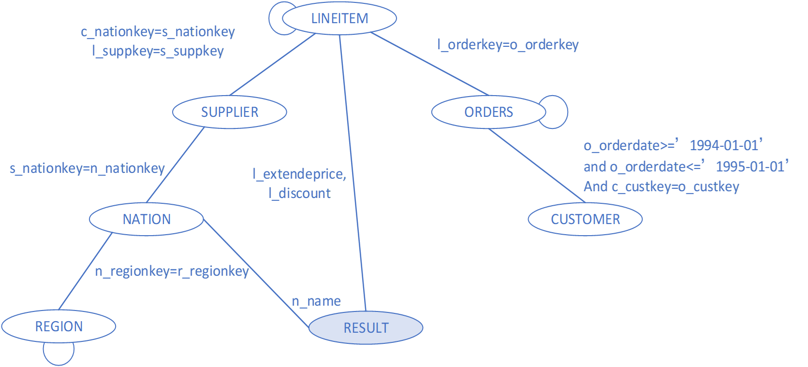
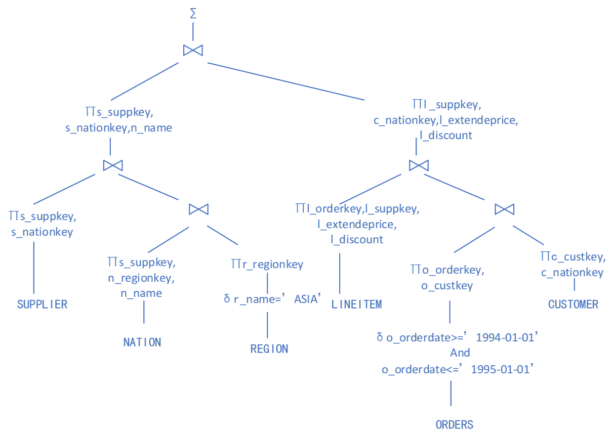
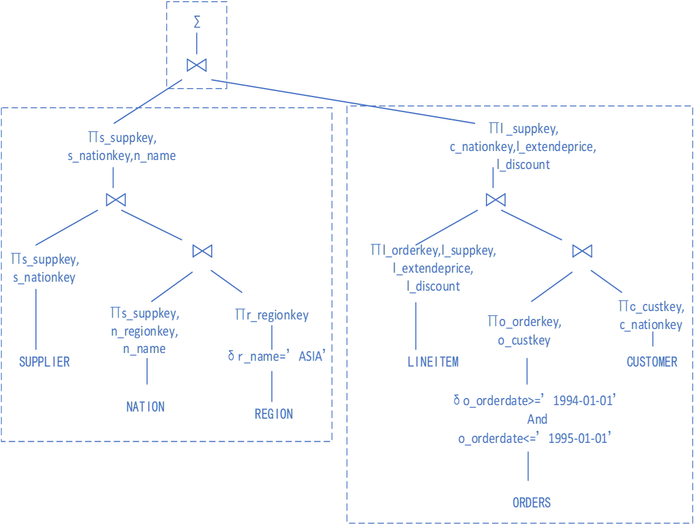
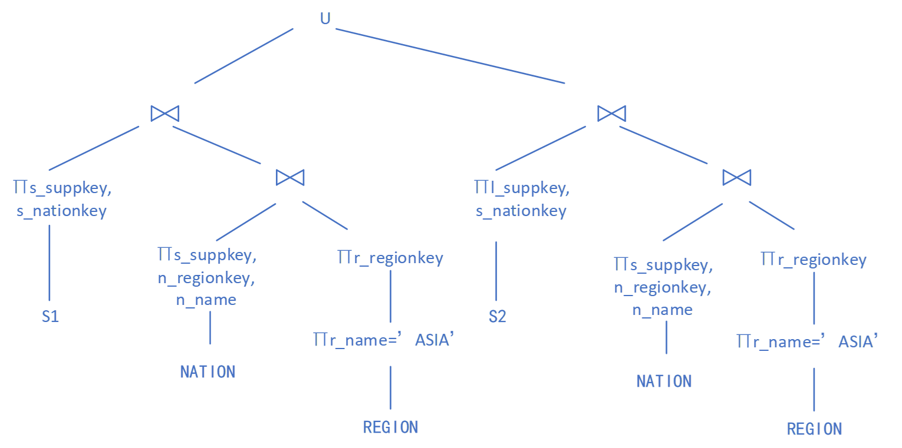
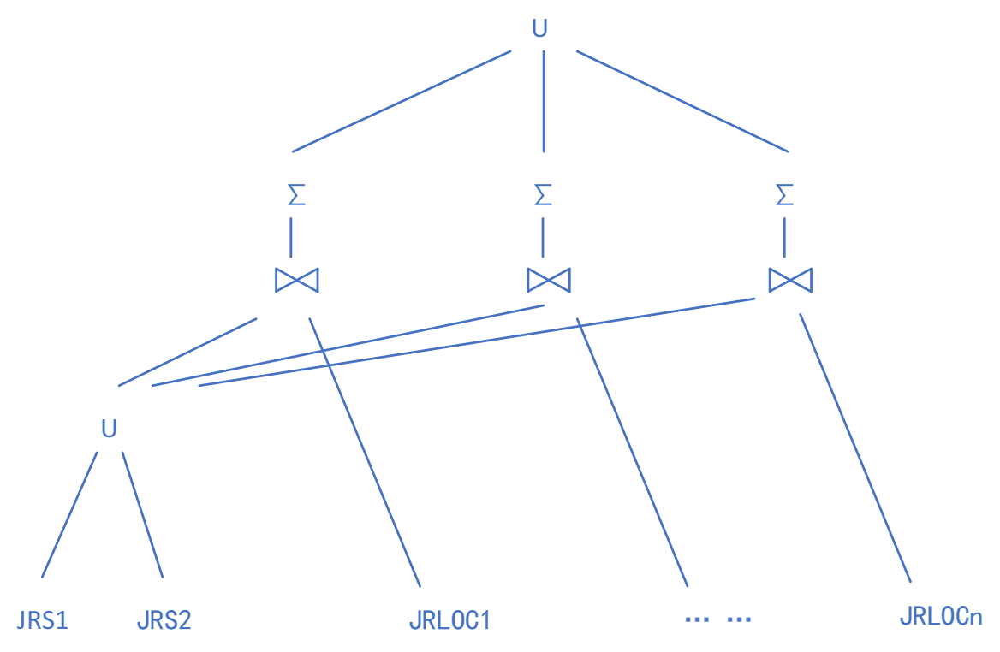
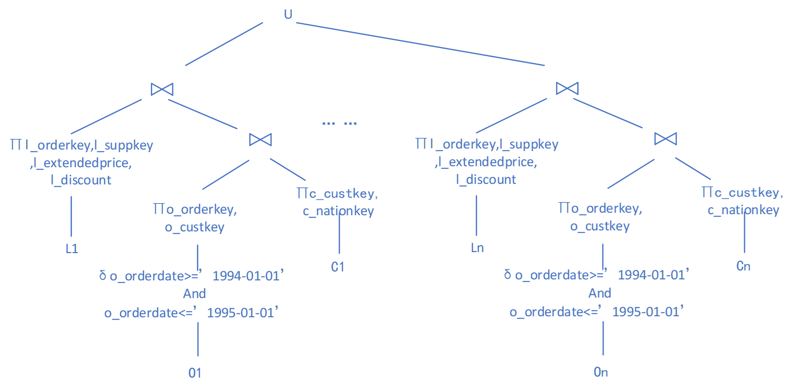

# 分布式查询处理优化

## 分布式关系数据库查询处理

### 查询分解

- **目标**：形成全局关系上的代数查询，输入输出都是全局的，与集中式数据库方法相同。
- **规范化**：将谓词表示为合取范式（外层用AND连接）或析取范式（外层用OR连接）
- **查询分析**：检查（全局）查询类型和语义是否错误或不规范，常用查询图完成。

**查询图**：一个节点表示结果集，其余节点表示操作的关系，两个节点都不是结果集的边代表连接操作，一个节点是结果集节点的边代表投影操作。
**连接图**：查询图中只考虑连接关系的子图。

查询图用于检查查询语义的正确性：

- 查询图不是连通图时，查询语义不正确；
- 图中有孤立节点时，表示相应的连接谓词错误。

**例子**：

```sql
select n_name, sum( l_extendedprice*(1-l_discount) ) as revenue 
from customer, orders, lineitem, supplier, nation, region //六表连接
Where c_custkey = o_custkey and l_orderkey = o_orderkey
and l_suppkey = s_suppkey and c_nationkey = s_nationkey
and s_nationkey = n_nationkey and n_regionkey = r_regionkey
and r_name = '[REGION]' //指定地区，在TPC-H标准指定的范围内随机选择
and o_orderdate >= date '[DATE]' //DATE是从1993年到1997年中随机选择的一年的1月1日
and o_orderdate < date '[DATE]' + interval '1' year
group by  n_name
order by revenue desc; //按收入降序排序
```

这个查询语句的查询图为



其中的连接到自己的边表示了对自身属性的筛选。

在查询分解阶段，通常要进行以下两种操作：

- **消除冗余**：通过对冗余查询谓词的检测约简查询
- **查询重写**：生成查询树，通过等价变换优化查询树（一元操作下推、减少二元操作等启发式规则）

前一个例子生成的查询树如下图所示。


### 数据局部化

**目标**：使用重构规则，将全局查询中的关系用相应的数据片段替换，将分布式查询映射为片段查询

**片段查询树**生成步骤：

- 先将分片树的水平节点转换成查询树的并集U节点；
- 再将分片树的垂直节点转换为查询树的连接⋈节点。

继续举之前的查询例子，其查询树按场地分成三个区域。这种划分方式的主要原因是为了优化查询性能和资源利用。通过将查询过程划分为不同的区域，可以在分布式系统中并**行执行各个部分**，从而提高查询速度。同时，这种方式也便于管理和维护，因为每个区域的查询逻辑相对独立，易于理解和调试。



### 查询存取优化

**目标**：对于片段查询的关系代数表达式，将其转换为可能的物理查询计划执行策略，通过分布式代价模型选择最优执行计划，作为分布式查询执行计划。主要优化对象是**连接操作**

**优化思路**：
①直接策略。当连接表R1,R2,…按连接属性参照分片时，每个节点上的数据片段都满足本地化连接操作要求，分布式连接可直接转化为节点间并行的连接子查询任务。
②全复制。当关系R和S执行分布式连接，且S较小时，S可采用全复制策略在每个R表分片场地创建副本（多副本冗余存储代价、副本同步代价）。

- 现在假设SUPPLIER表有两个水平分片S1和S2，分布在节点PS1和PS2上。较小的NATION表和REGION表复制到节点PS1和PS2执行连接子树操作。
用分片树替换查询处理区域①的查询子树改写。可以看到需要对两个分片分别进行相同的操作，当然这是可以并行执行的。


③广播。当关系R和S执行分布式连接，且S较小或S上的结果集较小时，还可将S表结果集通过广播方式复制到R表数据片段节点，执行本地化连接操作。

- 如果SUPPLIER表的U节点查询子树结果较小，采用复制方式广播到LINEITEM、ORDERS、CUSTOMER表的n个分片节点，与结果集进行本地化连接操作，并将可分布执行的分组聚集函数下推到分片节点执行，最后将各节点结果归并。这样比把每一个JRLOC的结果送到SUPPLIER所在的地方进行连接开销小。


④动态水平分片。当关系R和S较大且未按相同的连接属性分片时，R与S执行动态水平分片连接操作：将两个关系按连接属性分片到指定的n个场地中，然后在n个场地执行分片连接操作。分片可以采用哈希、范围、列表等方法，实现负载均衡。

- 假设LINEITEM、ORDER、CUSTOMER表通过**参照分片**(按照一个相同外码的值进行分片，是水平分片的一种)策略，将三个表之间的连接子集哈希分片到节点$JRLOC_1, JRLOC_2,…, JRLOC_n$上
查询处理区域②的查询子树改写为


⑤高速网络的精简结果集汇总。高速局域网和不对称硬件构成的分布式系统，数据存储节点上的数据片段执行下推的选择、投影、连接过滤（布隆过滤）等操作，缩减连接表结果集，过滤后的连接表通过高速网络传输到高端查询处理节点执行全局连接操作。

### 局部查询优化

**目标**：通过代价模型优化查询处理性能

利用半连接操作降低网络通讯代价
