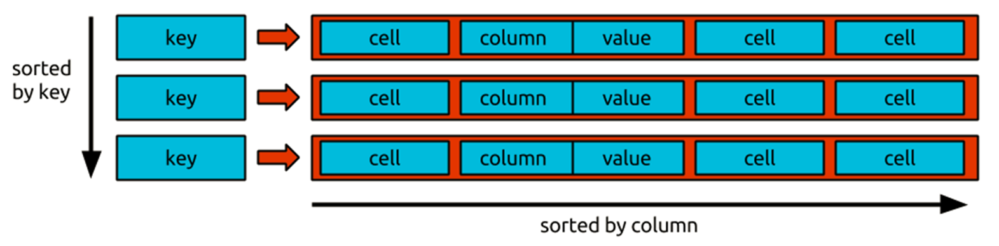
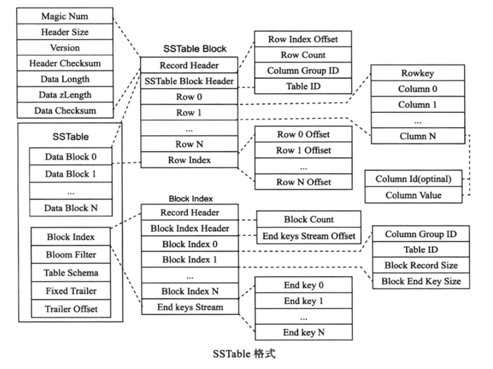
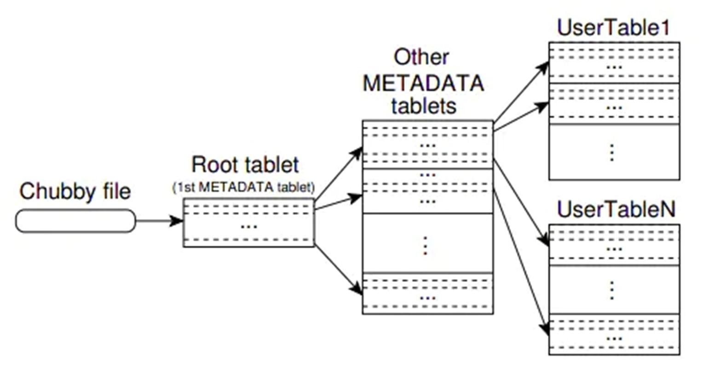

# BigTable

本质上说，Bigtable是一个键值（key-value）映射，是一个稀疏的，分布式的，持久化的，多维的排序映射。

Bigtable又可以看作是一个**多维map**，map的键有三维，分别是行键（row key）、列键（column key）和时间戳（timestamp），行键和列键都是字节串，时间戳是64位整型，而值是一个未经解析的字符串。表示一条键值对记录可以采取如下形式：
(**row:string, column:string, time:int64**)→**string**

Bigtable 会将数据持久化成 **SSTable（ Sorted String Table）** 的格式，该格式下的 key 都是经过排序后不可变的 KV 对。
每个 SSTable 由 block 组成，并通过 block index 来定位每个 block。
Bigtable内存中维护着memtable用以处理写请求。客户端对Bigtable的写操作首先会被内存中memtable处理，当memtable的大小超过一定阈值时，会生成新的memtable，并将老的memtable通过日志的机制合并到SSTable格式的文件中。

## SSTable

这张图详细展示了 **SSTable**（Sorted String Table）的结构及其内部组成。SSTable 是一种持久化的、不可变的文件格式，广泛应用于分布式存储系统（如 Bigtable 和 HBase）中，用于高效地存储和查询有序的键值对。以下结合图片进行详细说明。

---

### **SSTable 的主要组成部分**

1. **Header（表头）**
   - **作用**：记录 SSTable 文件的元信息。
   - **字段**：
     - **Magic Num**：标识文件格式的唯一标识符。
     - **Header Size**：表头大小。
     - **Version**：文件版本信息。
     - **Header Checksum**：表头的校验值。
     - **Data Length** 和 **Checksum**：数据部分的长度和校验。

2. **Data Blocks（数据块）**
   - **作用**：存储实际的键值数据。
   - **内容**：每个块内包含若干行数据（Row），行数据按照行键（Row Key）排序。
   - **字段**：
     - **Row 0, Row 1, ..., Row N**：按行存储的记录。
     - 每行包含：**Row Key** 和对应的列族（Column Family）信息。

3. **Row Index（行索引）**
   - **作用**：用于快速定位行数据在 Data Block 中的位置。
   - **内容**：
     - **Row 0 Offset, Row 1 Offset, ..., Row N Offset**：行数据在块中的偏移位置。

4. **Block Index（块索引）**
   - **作用**：记录每个数据块的位置信息，支持高效的块级定位。
   - **字段**：
     - **Block Index Header**：块索引头信息。
     - **Block Index N**：每个块的元信息，例如起始行键（End Key）。

5. **Bloom Filter**
   - **作用**：快速判断某个键是否可能存在于 SSTable 中，减少不必要的磁盘 I/O。
   - **内容**：基于位数组和哈希函数构建的概率性结构，支持高效检索。

6. **Fixed Trailer（固定尾部）**
   - **作用**：记录一些文件结束位置的元信息。
   - **字段**：
     - **Trailer Offset**：尾部的偏移量。

---

### **SSTable 的关键特点**

1. **有序性**：
   - 数据按行键（Row Key）全局有序，方便范围查询和二分查找。

2. **不可变性**：
   - 一旦写入完成，文件不可修改，所有更新或删除操作通过新的 SSTable 文件实现。

3. **高效检索**：
   - **行索引**和**块索引**结合，支持快速定位行或块。
   - **Bloom Filter** 减少不必要的查找开销。

4. **压缩和校验**：
   - 数据块可以进行压缩（如 Snappy 或 GZIP）以节省存储空间。
   - 校验机制保证数据一致性和完整性。

---

### **操作流程示例**

1. **写入**：
   - 数据以 **MemTable**（内存表）形式先存储于内存，达到阈值后以 SSTable 格式刷写到磁盘。

2. **读取**：
   - 检索某个键：
     1. 查询 **Bloom Filter** 确认键可能存在。
     2. 使用 **块索引** 定位包含该键的 Data Block。
     3. 在块内通过 **行索引** 找到目标键对应的值。

3. **合并**：
   - 定期执行合并（Compaction），将多个 SSTable 文件合并为一个，去除重复或过期数据。

---

### **示例说明**

查找 SSTable 时，首先从子表的索引信息中读取 SSTable Trailer 的偏移位置，接着获取 Trailer 信息。根据 Trailer 中记录的信息，可以获取块索引的大小和偏移，从而将整个块索引加载到内存中。

假设我们检索行键 `R123` 的数据：

1. 使用 **Bloom Filter** 判断 `R123` 是否可能存在。
2. 通过 **块索引** 找到包含 `R123` 的块，例如 `Data Block 2`。
3. 进入块内，通过 **Row Index** 定位到 `Row 3`，读取 `R123` 的具体列值。

---

### **总结**

SSTable 通过结构化设计和优化检索过程，支持高效的随机访问和范围查询，是现代分布式存储系统中的核心组件。结合索引、过滤器等机制，能够大幅提升查询性能并保证存储的可靠性和扩展性。

这张图展示了 **Bigtable** 的数据检索机制和元数据管理结构。Bigtable 是一种分布式、可扩展的大规模数据存储系统，支持高效的数据检索。下面结合图示进行详细介绍：

---

## **Bigtable 的层级结构**

1. **Chubby File**：
   - **作用**：作为分布式锁服务，用于存储元数据的位置。
   - **内容**：记录了根 Tablet（Root Tablet）的位置信息。
   - **步骤**：数据检索的第一步是通过 Chubby 获取 Root Tablet 的位置。

2. **Root Tablet**：
   - **作用**：根 Tablet 存储了指向其他 Metadata Tablets 的元数据信息。
   - **内容**：每个条目记录了 Metadata Tablets 的位置。
   - **步骤**：客户端通过根 Tablet，定位需要查询的 Metadata Tablet。

3. **Metadata Tablets**：
   - **作用**：存储每个用户表（UserTable）的分片信息（Tablet 信息）。
   - **内容**：记录了每个用户表分片（Tablet）的位置信息和范围。
   - **步骤**：通过 Metadata Tablets，确定目标数据所在的具体 Tablet。

4. **User Tables**：
   - **作用**：实际存储用户数据。
   - **内容**：用户表被划分为多个分片（Tablet），每个 Tablet 存储一定范围的行键（Row Key）数据。
   - **步骤**：根据 Metadata Tablets 确定的分片位置，访问具体分片完成数据检索。

---

### **Bigtable 数据检索流程**

1. **获取 Root Tablet 的位置信息**：
   - 客户端从 **Chubby** 文件中读取 Root Tablet 的位置信息，获得访问入口。

2. **访问 Root Tablet**：
   - 客户端查询 Root Tablet，找到目标 **Metadata Tablet** 的位置信息。

3. **访问 Metadata Tablet**：
   - 客户端根据 Root Tablet 提供的元数据信息，定位到目标数据所在的分片（Tablet）。

4. **访问 User Tablet**：
   - 最终，客户端直接访问目标分片（UserTable 的特定 Tablet），完成数据检索。

---

### **检索过程的优势**

1. **分级索引**：
   - Root Tablet 和 Metadata Tablet 构成分级结构，减少了检索范围，提高了查找效率。

2. **分片管理**：
   - 用户表被分为多个 Tablet，分布在不同的服务器上，支持水平扩展和并发访问。

3. **动态负载均衡**：
   - Tablet 的分布可以根据负载动态调整，进一步提升性能。

---

### **例子：检索一个特定的行键**

假设我们要检索 UserTable1 中 Row Key 为 `R123` 的数据：

1. **从 Chubby 获取 Root Tablet 的位置**。
2. **在 Root Tablet 查找**，发现 Row Key `R123` 的 Metadata Tablet 是第二个 Metadata Tablet。
3. **访问对应 Metadata Tablet**，查找发现 `R123` 位于 UserTable1 的第一个 Tablet。
4. **访问第一个 Tablet**，快速定位到 Row Key `R123`，返回对应数据。

---
