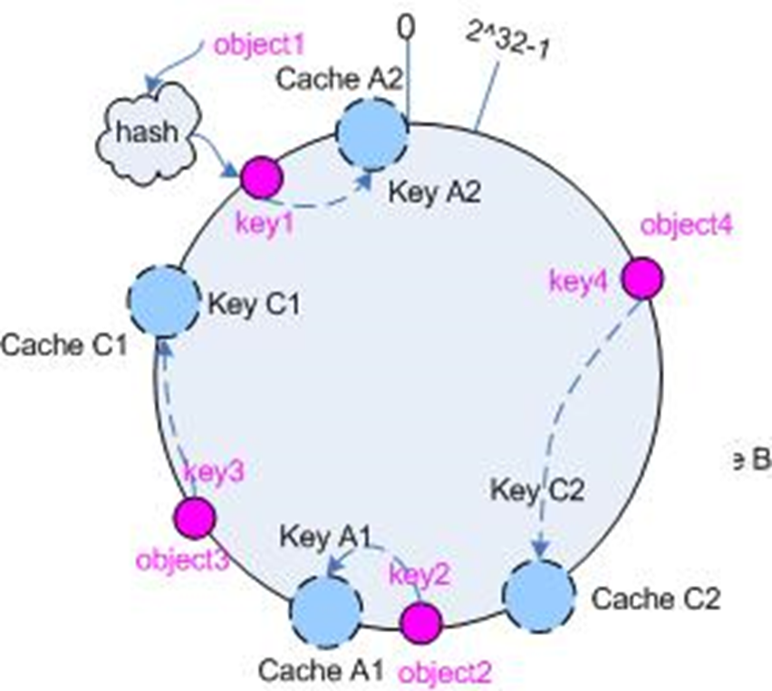

# Memcached


---

## **核心流程解析**

1. **缓存设计：Key-Value 模型**  
   - 使用基于键值对的 `HashMap` 结构存储数据。
   - 两种数据来源：  
     - **SQL 查询结果**（例如用户的 `user_id`）。  
     - **普通变量**（如系统运行中的临时变量）。  
   - 数据的键（Key）通过 `get_key()` 函数生成，确保唯一性和便于查询。

2. **代码逻辑：检查缓存是否命中**
**条件判断**：先通过 `get()` 方法检查缓存中是否已经有需要的数据。

```perl
if (!$user_id_by_email) { ... }
```

- 如果未命中（返回空值），进入查询数据库的流程。
- 如果命中，则直接返回缓存的数据。

1. **数据库查询并写入缓存**
   - 使用数据库语句从表中提取数据：  

     ```perl
     $query = "select user_id from user where email=?";
     ```

     - SQL 查询通过占位符的形式绑定参数，防止 SQL 注入。
     - 提取到的结果通过 `$sth->fetchrow_hashref()` 转为哈希格式。
   - 将查询结果以键值对的形式存储到 Memcached：  

     ```perl
     Zorpia::MemCache::set($key, $user_id_by_email, 1800);
     ```

     - 其中 `1800` 是缓存的过期时间（秒）。

2. **缓存的管理与更新策略**
   - 指定缓存过期时间，确保数据的新鲜性。若未指定，Memcached 按照 LRU 算法（最近最少使用）自动淘汰旧数据。
   - 数据结构优化，通过 `get_key` 函数对 key 的生成方式进行自定义设计，确保效率和一致性。

---

## Memcached 分布式缓存与哈希算法介绍

Memcached 是一种分布式的内存缓存系统，其设计目标是提升高并发应用程序的性能。在分布式场景中，它通过将数据分布在多个缓存节点上，实现负载均衡与扩展性。关键技术点包括数据分布策略，而普通哈希和一致性哈希是两种常见的算法。

---

### **1. Memcached 分布式缓存工作机制**

1. **数据分布**：
   - Memcached 是无状态的，多个实例可以通过客户端进行分布式管理。
   - 数据通过某种哈希算法映射到不同的缓存节点，确保同样的 Key 始终映射到同一个节点（除非节点拓扑发生变化）。

2. **工作流程**：
   - **存储**：当存储一个键值对时，Memcached 客户端会通过哈希算法计算出 Key 的哈希值，并根据哈希值将数据映射到一个缓存节点。
   - **检索**：检索时，客户端使用相同的算法定位到对应节点，取出缓存的数据。

3. **扩展性**：
   - Memcached 可以动态增加或减少缓存节点，但节点变动时，不同的哈希算法对缓存的影响会不同。

---

### **2. 普通哈希算法**

普通哈希算法直接将 Key 的哈希值映射到节点列表中的某个节点，其计算方式简单：
\[ \text{节点索引} = \text{Hash}(Key) \% N \]其中：

- \( N \) 是缓存节点的数量。
- \( \% \) 是取模运算，用来确保节点索引在 \( 0 \) 到 \( N-1 \) 范围内。

#### **优点**

1. 简单易实现，计算效率高。
2. 适用于节点固定不变的场景。

#### **缺点**

1. **节点变动导致大量缓存失效**：
   - 当增加或移除一个节点时，所有 Key 的哈希值需要重新计算，导致大部分缓存失效。
   - 例如：如果 \( N = 4 \)，增加一个节点后 \( N = 5 \)，几乎所有数据都会被重新分配。
2. **负载不均衡**：
   - 如果 Key 的分布不均匀，某些节点可能会存储更多数据，导致负载不均。

---

### **3. 一致性哈希算法**

一致性哈希是一种更适合分布式缓存的算法，特别是在动态增加或减少节点的情况下。

#### **核心思想**

1. 将整个哈希空间映射为一个逻辑上的环（Hash Ring），哈希值的范围通常为 \( 0 \) 到 \( 2^{32}-1 \)。
2. 节点和 Key 都会通过哈希函数映射到环上的某个点。
   - 每个 Key 会被存储到顺时针方向第一个节点上。
   - 如果某个节点失效，数据会自动分配到下一个节点，其他节点数据不受影响。


#### **步骤**

1. 对缓存节点和 Key 分别进行哈希。
   - 节点：通过 \( \text{Hash}(Node) \) 映射到哈希环。
   - Key：通过 \( \text{Hash}(Key) \) 映射到哈希环。
2. 数据存储到环上顺时针的第一个节点（或者它的副本节点）。

**优点**：

1. **减少缓存失效**：
   - 节点变动时，只有一部分 Key 需要重新分配，大量缓存仍然有效。
2. **动态扩展性**：
   - 可以动态增加或删除节点而不破坏整体系统。
3. **负载均衡**：
   - 可以通过“虚拟节点”（将一个物理节点映射成多个虚拟节点）均匀分布数据，防止单点负载过重。

**缺点**：

1. 算法复杂度较高，计算成本比普通哈希稍大。
2. 配置和实现较为复杂。

---

### **4. 对比：普通哈希与一致性哈希**

| 特性              | 普通哈希算法                           | 一致性哈希算法                             |
|-------------------|---------------------------------------|-------------------------------------------|
| **分布均衡性**    | Key 分布可能不均匀                   | 数据均匀分布，可通过虚拟节点优化         |
| **缓存命中率**    | 节点变动时大部分缓存失效             | 节点变动时仅部分缓存失效                 |
| **动态扩展性**    | 增加/删除节点会导致数据大规模迁移     | 节点变动时仅影响部分 Key 的分布          |
| **实现复杂度**    | 简单，直接取模运算                   | 较复杂，需要构建哈希环                   |
| **适用场景**      | 节点固定的简单分布系统               | 节点动态变化的分布式缓存系统             |

---

### 虚拟节点优化一致性hash



一致性哈希算法在负载均衡和动态扩展方面有明显优势，但仍然可能存在**负载不均**的问题：

- 如果物理节点较少，某些节点可能分配到更多的 Key，导致某些节点负载过重。  
- 这是因为物理节点在哈希环上分布可能不均匀，影响了数据的分布平衡。

为了解决这个问题，引入了 **虚拟节点（Virtual Nodes, 简称 VNode）** 的机制。

---

### **1. 什么是虚拟节点？**

虚拟节点是逻辑上的节点，每个物理节点会被映射为多个虚拟节点，并均匀分布在哈希环上。  
例如：如果有 3 个物理节点 \( A, B, C \)，可以映射为多个虚拟节点 \( A1, A2, A3, \dots \)，\( B1, B2, B3, \dots \)，\( C1, C2, C3, \dots \)。

#### **特性**

- 一个物理节点可以对应多个虚拟节点。
- Key 在哈希环上的映射仍然指向最近的虚拟节点，但最终存储数据的地方是虚拟节点所属的物理节点。

---

### **2. 虚拟节点的作用**

#### **1. 提高负载均衡**

- 物理节点数量少时，直接映射可能导致负载不均（某些物理节点分配的 Key 明显多）。
- 引入虚拟节点后，节点的分布更加均匀，因为虚拟节点增加了哈希环上的节点密度。

#### **2. 减少节点变动时的影响**

- 当一个物理节点加入或退出时，仅需重新分配其对应的虚拟节点上的数据，而不会影响整个系统的大多数数据。
- 数据迁移量减少。

---

### **3. 虚拟节点的实现步骤**

#### **1. 构造虚拟节点**

- 给每个物理节点生成多个虚拟节点，并将它们映射到哈希环。
- 虚拟节点的名字可以通过附加编号或其他标记生成，例如：
  - 对于物理节点 \( A \)，虚拟节点可以命名为 \( A1, A2, A3, \dots \)。
  - 使用哈希函数对虚拟节点命名后的字符串计算哈希值，将虚拟节点分布到哈希环上。

#### **2. 查找数据对应节点**

- Key 的哈希值映射到哈希环上，找到顺时针方向最近的虚拟节点。
- 根据虚拟节点所属的物理节点，将数据存储到该物理节点上。

#### **3. 动态变动处理**

- **新增物理节点**：为新增节点创建多个虚拟节点并分布到环上，部分 Key 被重新分配到新节点。
- **删除物理节点**：移除对应的虚拟节点，受影响的 Key 重新映射到下一个虚拟节点所属的物理节点。

---

### **4. 示例：虚拟节点优化一致性哈希**

假设有 3 个物理节点 \( A, B, C \)，每个物理节点对应 3 个虚拟节点：

1. 哈希环分布：
   - \( A1, A2, A3, B1, B2, B3, C1, C2, C3 \)
   - 这些虚拟节点通过哈希函数均匀分布在环上。

2. 数据分布：
   - Key 的哈希值映射到哈希环上最近的虚拟节点，例如：
     - Key1 → \( A2 \) → 存储到物理节点 \( A \)
     - Key2 → \( B1 \) → 存储到物理节点 \( B \)
     - Key3 → \( C3 \) → 存储到物理节点 \( C \)

3. 动态扩展场景：
   - **新增节点 \( D \)**：
     - 新增节点 \( D \) 对应 \( D1, D2, D3 \)，均匀插入到哈希环上。
     - 部分 Key 被重新分配到 \( D1, D2, D3 \)，如 Key1 从 \( A2 \) 转移到 \( D1 \)。
   - **删除节点 \( B \)**：
     - 移除 \( B1, B2, B3 \)，这些虚拟节点上的 Key 重新分配到其他虚拟节点，如 Key2 从 \( B1 \) 转移到 \( C2 \)。

---

### **5. 虚拟节点的优势**

#### **1. 更高的负载均衡性**

- 通过虚拟节点的均匀分布，减少物理节点之间的负载差异，提升分布式系统的性能。

#### **2. 数据迁移量更小**

- 节点变动时，仅需要迁移受影响的虚拟节点上的数据，而不是整个物理节点的 Key。
- 数据稳定性更高，缓存命中率更好。

#### **3. 适应大规模分布式系统**

- 在有大量节点的场景下（例如 100+ 物理节点），虚拟节点确保系统保持高效分布。

---

### **6. 虚拟节点数量的权衡**

- 虚拟节点数量需要根据物理节点数量和系统规模进行调整：
  - **虚拟节点过少**：负载均衡效果有限。
  - **虚拟节点过多**：增加哈希计算和管理的开销。

- 实际使用中，通常为每个物理节点创建 100~200 个虚拟节点。

---
