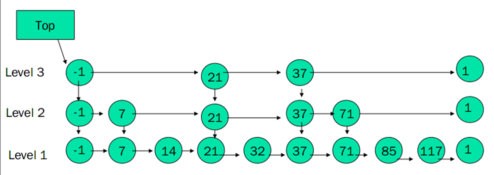

# Redis

Redis是一个key-value存储系统，和Memcached类似，Redis以内存作为数据存储介质，所以读写数据的效率极高，远远超过数据库。每个DB中的所有数据都是Key-Value对，其中的Value支持5种类型，分别是：

- 字符串类型（String）
- 哈希表类型（Hash）
- 链表类型（List）
- 集合类型(Set)
- 有序集合类型（order set）

这里我们介绍课堂划重点：**有序集合**。

## 有序集合

有序集合保留了集合**不能有重复成员**的特性，但是有序集合中的元素是可以排序的，它给每个元素设置一个分数（score）作为排序的依据，从而实现插入有序，即自动排序。有序集合中的元素不可以重复，但是score 分数 可以重复。

实现：采用**HashMap和跳跃表SkipList**来保证数据的存储和有序，HashMap记录成员到score的映射，跳跃表实现排序，HashMap里存的score作为排序依据

**Skip List**：一种（对数）随机化的数据结构，基于并联的链表，其效率相当于二叉查找树（对于大多数操作需要O(log n)平均时间）。

### **Skip List 的概念和原理**

**Skip List（跳表）**是一种支持快速搜索、插入和删除的概率平衡数据结构。它是链表的扩展，通过在链表上增加多级索引来加速操作，时间复杂度接近于平衡二叉树。它是 **Redis** 和 **LevelDB** 等系统的底层实现之一。

---

### **跳表的特点**

1. **层级结构**：
   - 基础是一个有序链表，额外添加多级“跳跃”索引，每一层是下一层的子集。
   - 最底层（Level 0）包含所有元素，上层的每一层逐步减少。
2. **概率性质**：
   - 每个元素以固定概率（通常为 0.5）被提升到更高一层。
   - 平均情况下，包含 \( n \) 个元素的跳表的高度为 \( \log_2 n \)。
3. **操作效率**：
   - 搜索、插入、删除的平均时间复杂度为 \( O(\log n) \)。
   - 最坏情况下退化为链表，时间复杂度为 \( O(n) \)。

---

### **跳表的基本结构**

每个节点存储以下信息：

- **值**：节点的值。
- **前进指针数组**：指向每一层的下一个节点。
- **高度**：节点被提升的层数。

---

### **跳表的构建**

跳表的构建从底层开始，通过随机化算法逐步创建上层索引。

1. **初始化跳表**：
   - 创建一个空的头节点，头节点的高度通常设置为一个固定的最大值（如 32）。
   - 所有层的头节点的指针最初指向 `null`。

2. **随机化节点高度**：
   - 每插入一个节点时，使用随机函数决定它的高度。

---

### **跳表的基本操作**

#### **1. 查找操作**

目标：在跳表中找到一个目标值 \( k \)。

**过程**：

1. 从最高层（最顶层索引）开始，从左向右扫描，直到遇到一个比 \( k \) 大的节点或到达当前层的尾部。
2. 跳到下一层，继续扫描，直到到达底层。
3. 如果找到与 \( k \) 相等的节点，则返回；否则，返回 `null`。

**时间复杂度**：\( O(\log n) \)

这张图展示了一个跳表的结构，从底层（Level 1）到顶层（Level 3）逐层递减，体现了跳表的多层索引特性。以下是结合图示的详细解析和操作说明：

---



### **图中跳表的结构解析**

1. **节点内容**：
   - 每个节点的值用圆形表示，例如 `-1`、`7`、`21` 等。
   - `-1` 通常是头节点（Head Node），用作起始点，指针连接跳表的每一层。

2. **层级关系**：
   - **Level 1** 是底层链表，包含所有节点，确保基础的有序性。
   - **Level 2 和 Level 3** 是上层索引，作为稀疏抽样，用于加速跳跃查找。

3. **跳跃指针**：
   - 每个节点存储指向不同层下一个节点的指针。
   - 例如：
     - 在 Level 3 中，`-1` 的指针直接跳到 `21`，跳过了中间的 `7`。
     - 在 Level 2 中，`-1` 的指针跳到 `7`，然后指向 `21`。

---

### **跳表的基本操作说明**

#### **1. 查找操作**

目标：找到目标值，例如 71。

**过程**：

1. 从顶层（Level 3）的起始节点 `-1` 开始，扫描右侧节点。
   - 在 Level 3，从 `-1` 跳到 `21`，然后跳到 `37`，发现 `37 < 71`，继续。
   - 从 `37` 跳到 `71`，发现目标节点，查找结束。

**特点**：

- 通过跳跃快速定位范围，逐层向下精确查找。
- 最坏情况下，需要逐层扫描到底层，复杂度为 \( O(\log n) \)。

---

#### **2. 插入操作**

目标：插入一个新值，例如 `50`。

**过程**：

1. **确定插入位置**：
   - 从顶层开始，通过跳跃和逐层扫描，定位到 `37` 和 `71` 之间的位置。
2. **随机生成高度**：
   - 假设随机生成高度为 2，则新节点 `50` 出现在 Level 1 和 Level 2 中。
3. **插入节点**：
   - 更新指针：
     - 在 Level 2：将 `37` 的指针指向 `50`，`50` 的指针指向 `71`。
     - 在 Level 1：类似更新。

**更新后结构**：

```
[Level 2]  37 --> 50 --> 71
[Level 1]  37 --> 50 --> 71
```

**时间复杂度**：平均 \( O(\log n) \)。

---

#### **3. 删除操作**

目标：删除值 37。

**过程**：

1. **定位节点**：
   - 类似查找操作，找到所有层中 `37` 的前驱节点。
2. **更新指针**：
   - 修改所有层中前驱节点的指针，使它们跳过 `37`，直接指向 `37` 的后继节点。
3. **清理节点**：
   - 删除节点 `37`。

**更新后结构**：

```
[Level 2]  -1 --> 50 --> 71
[Level 1]  -1 --> 50 --> 71
```

**时间复杂度**：平均 \( O(\log n) \)。

---

### **跳表的层级与性能关系**

1. **稀疏索引**：
   - 每一层的节点数量减少一半，形成稀疏结构。
   - 在图中：
     - Level 1 有所有节点。
     - Level 2 仅包含 `-1, 7, 21, 37, 71`。
     - Level 3 更加稀疏，仅包含 `-1, 21, 37`。

2. **加速查找**：
   - 通过稀疏索引，跳表避免了遍历每个节点，大大加速了查找和插入操作。

---
