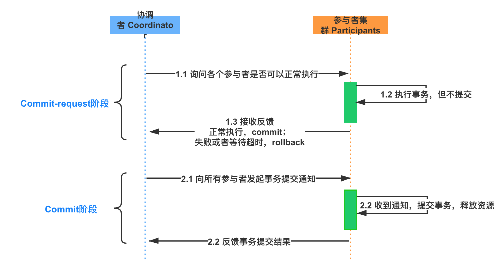
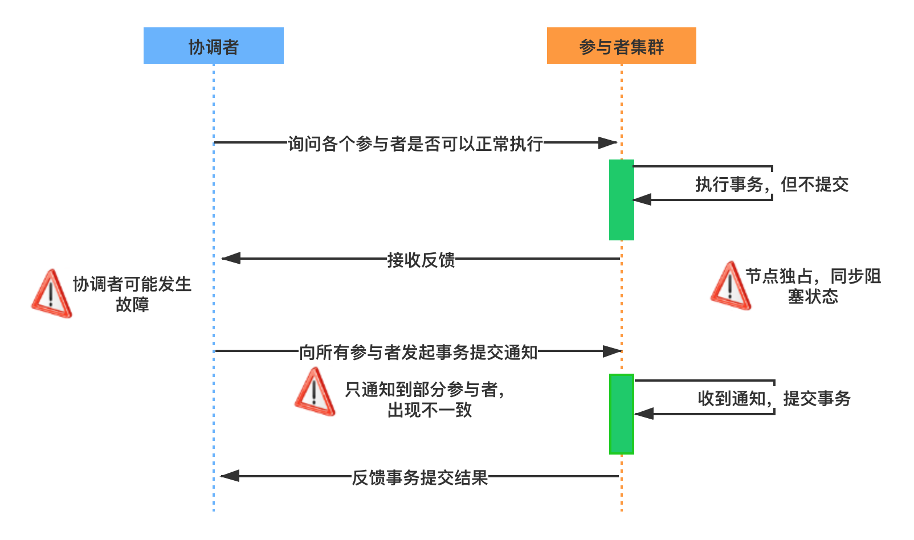
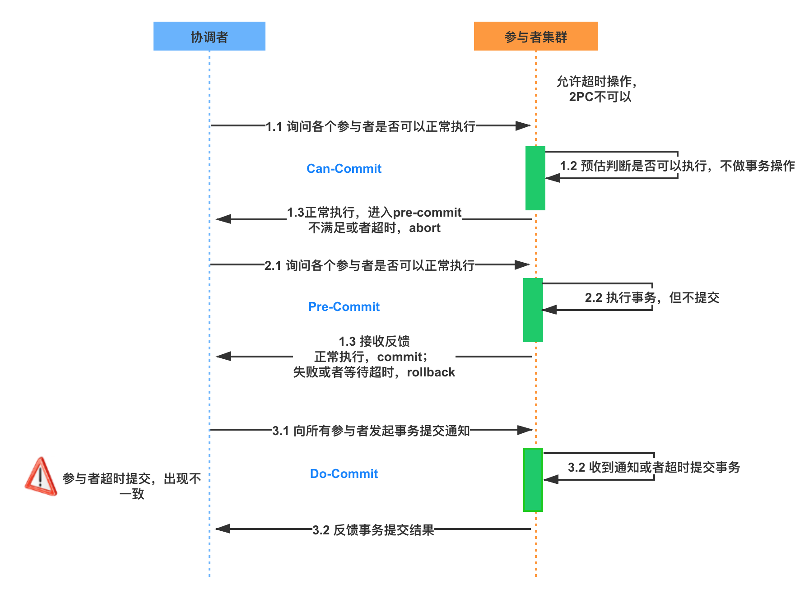

# 分布式事务

## 并发访问控制技术

事务处理机制的核心是并发访问控制技术，主要包括五种，这里介绍期末的重点Time-stamp Odering和Commitment Ordering算法

### TO

多个事务按照时间戳的顺序来访问数据项，如果$TS(T_i) \lt TS(T_j)$那么事务管理器保证调度结果等价于事务$T_i$出现在$T_j$之前的某个串行调度。

### CO

**Commitment Ordering** **提交排序算法** 一种主流的并发访问控制技术，该算法能确保分布式写事务全局可串行化，使多个独立自治的RM（Resource Manager，资源管理器，参与者）上并发的分布式写事务保持高效的全局可串行化。局部CO（单点上的CO算法），是保证多个独立自治的RM间实现全局可串行化的充要条件。CO允许每个RM使用不同的并发控制机制，可以和单节点上的封锁、TO、MVCC等并发控制机制结合使用。

**算法定义**：在调度中等待提交的两个事务T1 T2，如果T1的优先级高于T2（T1与T2存在冲突），调度器在排定事务提交顺序的时候，要确保事务T1先于T2提交（T1时间戳小）
**证明**：假设若CO调度历史H 是不可串行化的，则H 的可串行化图中存在环路，依据CO的规则，得出环中的事务先后顺序出现前后矛盾，故得知假设不成立。

#### 基于CO的调度器

COCO（commitment order coordinator，提交排序协调器）：只保证CO，不保证可恢复性。

**CORCO**（ CO recoverability coordinator，提交排序可恢复协调器）：同时保证CO和可恢复性，会终止更多的事务。CORCO有一个强化的可序列化图wrf-USG=(UT, C∪$C_{wrf}$)，其中：

- UT：未决定的事务，
- C和$C_{wrf}$：边的集合，两个边集合没有交集。如果事务T2与T1冲突（T1先发生）且T2没有从T1读取数据，则C中有一条有向边从T1指向T2。如果T2从T1读取了数据，则$C_{wrf}$中有一条边从T1指向T2（写-读边）。
- ABORTCO(T)：在C或者Cwrf中指向T的结点组成的集合，即为T提交后被“终止”的事务集合。
- ABORTREC(T’)：由于可恢复性而被终止的事务组成的集合，从T’读的节点和从ABORTREC(T’)中读的结点，该定义是递归的，反映级联终止的特性。

**算法目的**：

- 确定哪些事务可以安全提交，哪些事务需要终止
- 避免级联终止
- 维护事务执行的正确性

**CORCO**算法过程：

1. 第一步：寻找独立事务
   - 在wrf-USG图中找没有输入边的事务
   - 这些事务是独立的，不依赖其他事务的写入
   - 这保证了不会发生级联终止

2. 第二步：处理终止事务
   - 对于ABORTCO(T)中的事务T'进行终止
   - 同时终止所有依赖于T'的事务(ABORTREC(T'))
   - 这确保了系统的一致性

3. 第三步：清理操作
   - 移除已处理的事务节点
   - 更新图结构

**example**:
在并发控制中：

- C：表示一般的冲突图边
- C_wrf：特指写后读依赖的边

假设有事务T1, T2, T3, T4, T5，它们之间存在以下关系：

1. 依赖关系：
   - T2 读取 T1 的写入 (C_wrf边)
   - T3 与 T2 有资源冲突，但不是读写依赖 (C边)
   - T4 读取 T2 的写入 (C_wrf边)
   - T5 是独立事务

可以表示为：

```php
T1 --C_wrf--> T2 --C--> T3
           |
           +--C_wrf--> T4
T5
```

按CORCO算法执行：

1. 首先找没有C_wrf输入边的事务：
   - T1和T5满足条件（它们没有读取其他事务的数据）

2. 假设T2在ABORTCO集合中：
   - 终止T2
   - 检查ABORTREC(T2)：需要终止T4（因为有C_wrf依赖）
   - 注意：T3虽然与T2有冲突，但不是C_wrf依赖，可以不终止

3. 移除被终止的节点（T2, T4）和相关边

最终结果：

- T1, T5可以安全提交（没有C_wrf输入边）
- T3可以继续（虽然与T2有C边，但不是C_wrf依赖）
- T2, T4被终止

这个例子更准确地体现了：

1. CORCO算法特别关注C_wrf（写后读）依赖
2. 只有C_wrf依赖才会导致级联终止
3. 普通的冲突关系(C边)不会导致级联终止

这种区分很重要，因为：

- C_wrf边表示严格的数据依赖关系
- 只有C_wrf依赖才会导致级联终止问题
- 普通的冲突关系可能通过调度来解决

这样的处理方式可以减少不必要的事务终止，提高系统的并发度。

## 两阶段提交

### 思路描述

两阶段提交算法的目的是解决分布式数据库的并发异常，保证提交阶段的原子性操作。它将事务的提交过程分为两个阶段：


- 准备阶段：协调者节点在本地记录Begin Commit信息到REDO日志;接着协调者向所有参与者询问是否可以执行提交操作，并等待所有参与者答复；收到消息的各参与者检查本地子事务是否可以提交，或者执行子事务操作直到提交前那一刻，将 undo 和 redo 信息记入子事务日志中，但不提交事务。如参与者认为可以提交，将Ready写入本地REDO日志并回应协调者Vote Commit消息，进入就绪状态等待协调者进一步消息；如果参与者本地失败，则返回Vote Abort消息，并写入Abort到本地日志。
- 提交阶段：
  - 若收到所有参与者的Vote Commit：协调者在本地记录Commit信息到REDO日志；接着协调者向所有参与者节点发出Global Commit消息，进入Commit状态；参与者收到Global Commit消息后，记录Commit消息到REDO日志，正式完成提交操作（设置了事务提交完成标志），释放事务期间占用的资源；随后参与者向协调者发送Commit End消息；如果协调者收到了所有参与者的的Commit End消息，在本地记录End Commit信息到REDO日志，完成事务。
  - 若收到某个参与者的Vote Abort，或者协调者在第一阶段的询问超时之前无法获取某些参与者的回应，协调者在本地记录Abort信息到REDO日志；随后协调者向所有参与者节点发出Global Abort消息，进入Abort状态；参与者收到Global Abort消息后，记录Abort消息到REDO日志，利用事务回滚机制执行回滚操作，释放事务期间占用的资源；然后参与者向协调者发送Abort End消息；等待协调者收到了所有参与者的Abort End消息后，事务完成，在本地记录End Abort信息到RED

### 缺点



- **同步阻塞**：参与者在等待其他参与者节点的响应过程中，所有的参与者节点都是事务阻塞的；
- **单点故障**：协调者一旦发生故障，参与者会一直阻塞下去，尤其在提交阶段，参与者都处于锁定事务资源的状态中；
- **数据不一致**：第二阶段，当协调者向参与者发送commit请求后，发生了局部网络异常或在发送commit请求时协调者发生了故障，若只有部分参与者收到了commit请求，但其他部分未接到commit请求的节点不会执行提交操作，此时出现了数据不一致现象。
- **事务状态丢失**：协调者发出commit消息后宕机，而接收到该消息的参与者也同时宕机，此时无法知道事务的真实状态。

### 改进策略

1. **三阶段提交（3PC）**：3PC是2PC的改进版，通过在第一阶段引入额外的准备阶段来解决某些情况下的阻塞问题，并引入超时机制，允许在发生单点故障时继续达成一致。

2. **基于消息的事务**：使用消息队列等消息传递机制来实现事务的一致性，事务的各个参与者将事务信息发送到消息队列中，协调者根据消息的发送情况来决定事务是否提交或者回滚。

3. **柔性事务**：柔性事务主要特点是保证“基本可用，最终一致”，它允许系统在面对故障时有更多的灵活性，而不是简单地回滚事务。

4. **Paxos协议和Raft算法**：这些协议都是针对分布式系统中事务一致性的改进和优化，提供了不同于2PC的一致性保证。

## 三阶段提交

### 核心思想

三阶段中的 Three Phase 分别为 CanCommit、PreCommit、DoCommit 阶段。


**CanCommit** 阶段
3PC 的 CanCommit 阶段其实和 2PC 的准备阶段很像。协调者向参与者发送 Can-Commit 请求，参与者如果可以提交就返回 Vote Commit 响应，否则返回 Vote Abort 响应。

**PreCommit** 阶段
协调者根据参与者的反应情况来决定是否可以继续事务的 PreCommit 操作。根据响应情况，有以下两种可能。
A. 假如协调者从所有的参与者获得的反馈都是 Vote Commit 响应，那么就会进行事务的预执行：

- 发送预提交请求，协调者向参与者发送 PreCommit 请求，并进入 Prepared 阶段；
- 事务预提交，参与者接收到 PreCommit 请求后，会执行事务操作；
- 响应反馈，如果参与者成功执行了事务操作，则返回 ACK 响应，同时开始等待最终指令。

B. 假如有任何一个参与者向协调者发送了 Vote Abort 响应，或者等待超时之后，协调者都没有接到参与者的响应，那么就中断事务：

- 发送中断请求，协调者向所有参与者发送 abort 请求；
- 中断事务，参与者收到来自协调者的 abort 请求之后，执行事务的中断。

**DoCommit** 阶段
该阶段进行真正的事务提交，也可以分为以下两种情况。

A. 执行提交

- 发送提交请求。协调者接收到参与者发送的 ACK 响应后，那么它将从预提交状态进入到提交状态，并向所有参与者发送 doCommit 请求。
- 事务提交。参与者接收到 doCommit 请求之后，执行正式的事务提交，并在完成事务提交之后释放所有事务资源。
- 响应反馈。事务提交完之后，向协调者发送 ACK 响应。
完成事务。协调者接收到所有参与者的 ACK 响应之后，完成事务。

B. 中断事务 协调者没有接收到参与者发送的 ACK 响应，可能是因为接受者发送的不是 ACK 响应，也有可能响应超时了，那么就会执行中断事务。

C.超时提交 参与者如果没有收到协调者的通知，超时之后会执行 Commit 操作

### 比2PC的优势

- 扩展了超时机制：在 2PC 中，只有协调者拥有超时机制，如果在一定时间内没有收到参与者的消息则默认失败，3PC 同时在协调者和参与者中都引入超时机制。在等待阶段超时后协调者或参与者会中断事务，相对于二阶段提交减小了阻塞范围。
- 避免了协调者单点问题：阶段 3 中，协调者出现问题时，参与者会继续提交事务。

### 劣势

- 缺少分区故障恢复，可用性不高，不能在发生分区故障时进行故障恢复，paxos算法解决了分区故障时的高可用问题；
- 耗时长，至少需要三次网络交互；
- 数据不一致，进入preCommit后，协调者特殊情况下还是可能发出abort请求，此时若只有一个参与者收到并回滚，其他对于系统状态未知的参与者会依据3PC选择继续Commit，此时系统状态出现不一致。
