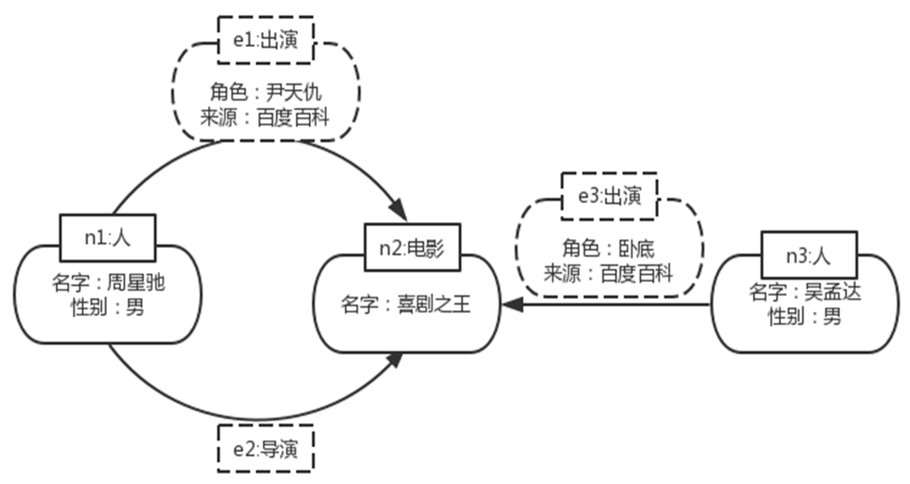
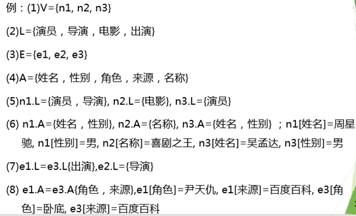

# 图数据库

## 属性图

### **属性图（Property Graph）概述**

属性图是一种广泛用于建模关系数据的图数据结构，它将**顶点（节点）**和**边（关系）**进行结构化存储，并为它们附加属性以提供丰富的语义信息。属性图通常表示为一个四元组 \((V, L, E, A)\)，其定义如下：

---

### **组成部分**

1. **顶点（Vertices，V）**
   - **定义**：顶点是图中的基本单元，用于表示实体、对象、或概念。
   - **集合**：\(V\) 是顶点集合，其中每个顶点都有一个唯一标识符。
   - **属性**：每个顶点可以附加属性，属性是键值对形式，用于描述顶点的特征。
     - 示例：`{id: 1, name: "Alice", age: 30}`。

2. **标签（Labels，L）**
   - **定义**：标签用于描述顶点或边的类别，为不同类型的顶点和边赋予语义。
     - 顶点标签：表示顶点的类别，例如 **"Person"** 或 **"City"**。
     - 边标签：表示边的关系类型，例如 **"FRIENDS_WITH"** 或 **"LOCATED_IN"**。
   - **集合**：\(L\) 是所有可能标签的集合。

3. **边（Edges，E）**
   - **定义**：边表示两个顶点之间的关系，是有向的或无向的。
   - **集合**：\(E \subseteq V \times V\)，即边是顶点对的子集。
   - **属性**：边也可以有属性，描述关系的特性。
     - 示例：`{type: "FRIENDS_WITH", since: "2020-01-01"}`。

4. **属性（Attributes，A）**
   - **定义**：属性是一组附加到顶点或边的键值对。
   - **集合**：\(A\) 是所有属性的集合，每个属性由键、值组成。
     - 键：描述属性的名称，例如 `name`, `age`, `since`。
     - 值：可以是字符串、数字、布尔值或嵌套结构。

---

### **属性图模型的特点**

1. **灵活性**
   - 属性图允许为顶点和边附加任意数量的属性，从而能以直观的方式建模复杂数据。

2. **丰富的语义表达**
   - 顶点和边的标签及属性提供了丰富的语义信息，便于理解和分析图结构。

3. **关系建模**
   - 边不仅表示顶点之间的关系，还可以通过属性描述关系的特性，例如时间戳、权重等。

4. **支持有向边**
   - 边可以是有向的，支持双向关系建模。

---

### **属性图的示例**

#### **用例：社交网络**

一个社交网络可以用属性图建模，其中：

- **顶点**表示用户或地点（如 "Alice", "Bob", "New York"）。
- **标签**描述顶点或边的类型（如 "Person", "City", "FRIENDS_WITH", "LOCATED_IN"）。
- **边**描述用户之间的关系或用户与地点的关系。
- **属性**附加信息（如年龄、关系时间）。

#### **具体表示**

顶点集合 \(V\):

```json
[
    {id: 1, label: "Person", properties: {"name": "Alice", "age": 30}},
    {id: 2, label: "Person", properties: {"name": "Bob", "age": 25}},
    {id: 3, label: "City", properties: {"name": "New York"}}
]
```

边集合 \(E\):

```json
[
    {source: 1, target: 2, label: "FRIENDS_WITH", properties: {"since": "2020-01-01"}},
    {source: 1, target: 3, label: "LOCATED_IN", properties: {"duration": "5 years"}}
]
```

---




## Cypher

Cypher设计的目的是一种人类查询语言，构造理念是基于英语单词以及灵巧的图解。Cypher是一个声明式的语言，它的关注点在于要从图中找回的内容是什么，而不关心怎么去做。它的许多关键字如`LIKE`和`ORDER BY`是受SQL的启发；模式匹配的表达式来自于SPARQL；正则表达式匹配的实现使用Scala programming language语言。

## Cypher基本命令

1. `CREATE`：创建顶点、边和属性。
2. `MATCH`：检索相关顶点、边和属性。
3. `RETURN`：返回查询结果。
4. `WHERE`：提供条件，过滤检索数据。
5. `REMOVE`：删除顶点和边的属性。
6. `SET`：添加或更新标签。

## Cypher对象创建

### 创建顶点

```cypher
CREATE (n1:导演:演员{名字：'周星驰', 性别：'男'}), (n2:演员{名字：'吴孟达', 性别：'男'})
```

### 创建边（有向边）

```cypher
CREATE (n1)-[r:导演]->(n2)
```

### 创建路径（含多个顶点和边）

```cypher
CREATE (n1)-[r1:导演]->(n2)-[r2:导演]->(n3)
```

## Cypher检索

### 检索顶点

```cypher
MATCH(n)
RETURN n
```

### 检索顶点（带条件）

```cypher
MATCH(n:movie)
RETURN n
```

## Cypher图匹配

```cypher
MATCH (n1)-[:导演]->(n2:电影)
MATCH (n1)-[:出演]->(n2:电影)
RETURN n1.姓名, n2.名称
```

## Cypher图导航

### 共同出演

```cypher
MATCH (t:Person {姓名：'吴孟达'})-[:出演]->(m1)<-[:出演]-(coActors),
      (coActors)-[:出演]->(m2)<-[:出演]-(co_co_Actors)
WHERE NOT (t)-[:出演]->()<-[:出演]-(co_co_Actors) 
AND t<>co_co_Actors
RETURN co_co_Actors.姓名
```

**可变数量的关系->节点**：判断顶点3到顶点2或4之间是否存在边标签为KNOWS且长度不超过3的路径，如果存在则返回相应路径的起点和终点。

```cypher
MATCH (a) WHERE id(a)=3
MATCH (x) WHERE id(x) IN [2,4]
MATCH a-[:KNOWS*1..3]->x
RETURN a, x
```

**最短路径**： shortestPath函数找出一条两个节点间的最短路径
例：找出两点1和2之间的一条最短路径，且搜索的最大关系长度为15

```cypher
MATCH (s) WHERE id(s) = 1    
MATCH (e) WHERE id(e) = 2    
MATCH p = shortestPath( (s)-[*..15]->(e))
RETURN p

MATCH (s) WHERE id(s) = 1    
MATCH (e) WHERE id(e) = 2
MATCH p = allShortestPaths( s-[*..15]->e )
RETURN p

```

## Cypher图与关系复杂操作

### 聚合（Aggregation）

```cypher
MATCH (n) WHERE id(n) = 2    
MATCH (n)-->(x)
RETURN count(x)
```

### With从句

WITH 决定传入下一阶段的数据

```cypher
MATCH (n:Person)-[r:ACTED_IN]->(o:Movie) 
WITH o, count(r) as count_r 
WHERE count_r > 8 
RETURN o
```

## Cypher图更新

### 图结构更新

#### 在已有节点基础上增加边

```cypher
MATCH (n1:演员：导演 {姓名：'周星驰'})
MATCH (n2:电影{名称:功夫})
CREATE (n1)-[E1:导演]-> (n2)
```

#### 删除顶点以及和顶点相连的边

```cypher
MATCH (n:演员:导演{姓名:'张三'})
DETACH DELETE n
```

#### 删除边

```cypher
MATCH (n:演员:导演{姓名：'张三'})-[r:导演]->()
DELETE r
```

### 图内容更新

#### 添加标签

```cypher
MATCH (n:导演:演员{姓名：'张三'})
SET n:编剧
```

#### 删除标签

```cypher
MATCH (n:导演:演员{姓名：'张三'})
REMOVE n:编剧
```

#### 添加属性 /重置属性

```cypher
MATCH (n:导演:演员{姓名：'张三'})
SET n.国籍='中国', 出生年月='1962-6-22'
```

#### 删除属性

```cypher
MATCH (n:导演:演员{姓名：'张三'})
SET n.国籍=NULL
```


