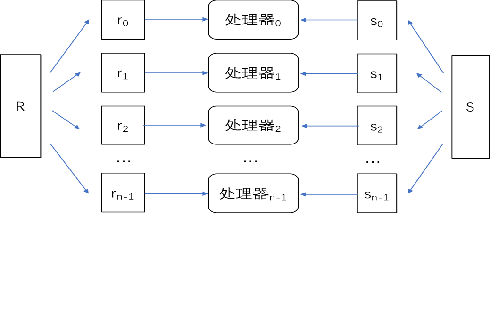
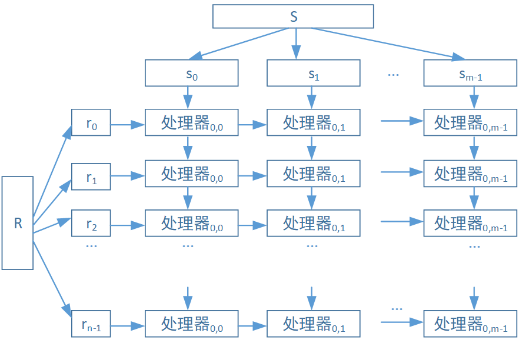
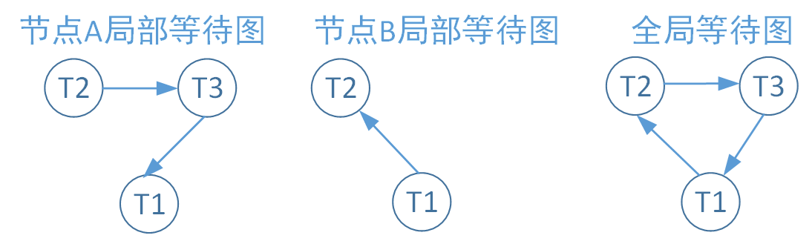
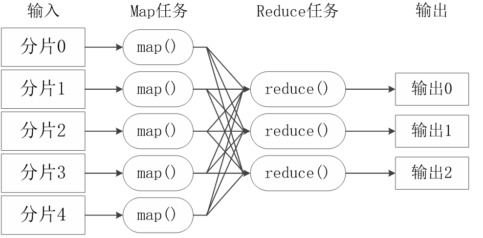

# 并行

P20-26 P53 P78-80 P127-138

## 数据存储访问的并行化

- 循环划分：均等地把元组存储在多个磁盘，适合全表扫描查询
- 散列划分：根据hash值把数据映射到磁盘上，适合点查询（查找特定值）
- 按范围划分：根据关系某个属性值的不同范围划分（容易出现数据偏斜）（适合划分属性商店范围查询）

## 查询操作的并行化

### 查询间并行

单个事务响应时间不变，但能有效提升系统的事务吞吐率（单位时间内完成的事务数量）。需要注意保证缓存一致性，同时要进行事务冲突和并发控制，不同处理器之间需要通信，需要设计锁和日志。

### 查询内并行

一个查询往往可以分解成为多个操作，通过操作间并行和操作内并行的方式实现查询内并行。

- 操作间并行：分为流水线并行和独立并行。
  - **流水线并行**：类似重叠执行，不需要等上一步完全做完，产生输出就扔给下一步。不适合所有运算，且个步骤时间可能不均匀，加速效果有限。对于三个关系的连接操作，操作间并行只能选择流水线并行，先计算R1与R2连接，结果作为下一步Result和R3连接的输入。而至于像**集差运算，是不适合流水线并行的**，因为在流水线并行中，每个阶段的输出大小通常是预先知道的，这有助于流水线的稳定运行。然而，集差运算的输出大小是不确定的，因为它取决于两个输入集合的重叠部分，这种不确定性使得流水线难以优化和平衡。
  - **独立并行**：互不依赖的操作独立执行。比如四个关系的连接可以先执行R1R2连接，R3R4连接，再把两者的输出进行连接
- 操作内并行：对数据进行划分，并行执行相同的操作后再连接（类似归并排序）
  - **划分连接**：将参与连接的两个关系R和S（针对连接条件）用相同的方式划分为n份，使得划分后的$r_i$和$s_i$处于同一个范围，$r_i \& s_j （i≠j）$之间的元组不满足连接条件，之后将各自的n个划分交给n个对应的处理器并行执行连接操作。
  - **分片-复制连接**:参与连接的两个关系R和S，可以（在连接属性上）分别按照不同的划分函数分片，处理器i，j只需负责处理R的第i分区和S的第j分区的数据的连接，从而并行操作。
  - **并行散列连接**:partition、build和probe阶段。partition阶段将R表的数据划分到不同的分区上，build阶段在各个分区上构建哈希表，probe阶段先将S表中的元组映射到对应的分区上，再进行连接操作。
    - **非阻塞分区**：非阻塞式分区只扫描一遍关系表R。对于每个元组，计算好该元组所在的分区后，直接将数据写入该分区。。Build阶段只关心hash表的产生，对于它输入的数据是否是完整的并不关心。此种方法只扫描一次输入关系并即时生成输出，通过另外的线程去读取输入产生的hash表等结果，从而不必要等到所有的线程都结束扫描再进入下一个阶段。
    - **阻塞分区**：阻塞式分区在执行过程中需要多次扫描关系表R。首先，它计算每个分区的大小，以及所有元组所在的分区，然后统一将数据写入对应的分区。多步骤传递数据：首先扫描R并计算每个哈希键的元组数量的直方图在某个偏移量处的基数。接着使用此直方图通过计算前缀和来确定输出偏移量。最后再次扫描R并根据散列键进行分区。由于需要预先计算分区大小并分配空间，这个过程通常需要等待所有分区准备就绪，因此阻塞了后续操作的执行。
  - 嵌套循环连接

## 分布式数据库中的并发控制

- **局部等待图**：每个节点维护一个局部等待图，用代表事务的结点间的有向图描述该节点相关事务的资源依赖关系；
- **全局等待图**：死锁检测时，协调器维护一个全局等待图，该图是所有局部等待图的并集。
- **跨节点事务**：当节点A的事务T1需要节点B中的某资源，而此时节点B上事务T2占用了该资源，则有向边T1→T2插入节点B的局部等待图（T1等待T2）。
- **死锁的判断**：无论是局部等待图还是全局等待图，图中出现环路，则表示出现死锁。

## MapReduce

- 大数据集拆分成多个小数据块在多台机器上并行执行
- Map任务通常运行在数据存储的节点上，**不同Map任务之间不会进行通信**
- Reduce任务对中间结果进行汇总得到最后的结果，**不同的Reduce任务间也不会发生任何信息交换**。
- 所有的数据交换都是通过MapReduce框架自身去实现。

## SpannerDB

Spanner不再是类似BigTable的版本化键值对存储，而是一个“临时多版本”的数据库，数据是存储在一个版本化的关系表里，存储的数据会根据其提交的时间打上时间戳，应用可以访问到较老的版本，老的版本也会被垃圾回收处理。
管理数据核心组件是spanserver节点，类似于Bigtable中tablet server，spanserver中管理的也是类似bigtable的tablet结构。一个spanserver由成百上千个tablet构成。
spanserver的Tablet中的数据是map结构:
**(key:string, timestamp:int64) –> string**
Spanner这种tablet的映射与Bigtable键值对的重要区别：**时间戳字段不再是Key的一个组成部分，而是单独作为一个独立项，从而构成了一个多版本的数据库**。

SpannerDB 特点：

- 严格的CP系统（放弃CAP中的A）以及高可用性
- 基于2PC协议的内部顺序一致性；
- 支持外部一致性，支持读写事务、只读事务、快照读；
- 全球化的分布式存储系统，且延迟是可接受的；
- 基于模式化的半关系表的数据模型。

### 数据模型

Spanner的模型属于半关系型模型，数据库根据客户端分割为一个表或者多个表的层次结构，类似于传统关系数据库中一对多关系。该层次结构的上层的表是一个目录表，目录表中每行都具有键Key，和子孙表中的所有以Key开始(以字典顺序排序)的行一起，构成了一个目录。

#### 目录

Spanner定义了一种在一系列键值映射上的桶抽象，称为 “目录（directory）”，它是包含公共前缀的连续key的集合。一个目录是数据放置的基本单元，同一个目录的所有数据都具有相同的副本配置。数据迁移时，在不同的Paxos组之间以目录为单位移动。

#### Spanner表

表和关系数据库表类似，具备行、列和版本值。每个表有包含一个或多个列的主键，主键形成了行的名称，每个表都定义了从主键列到非主键列的映射。

### 与BigTable对比

#### 相似

- 管理的spanserver类似Bigtable中的tabletserver
- spanserver中的数据结构也是类似tablet的结构
  
#### 差异

- 时间戳字段不再是Key的一个组成部分，而是单独作为一个独立项，从而构成了一个多版本的数据库
