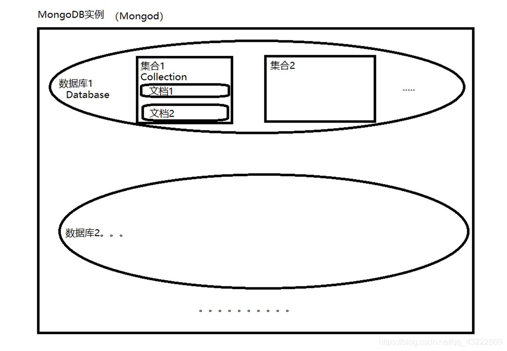

# MongoDB

MongoDB是通用型文档数据库，存储模型为BSON(Binary JSON)文档。由C++语言编写，旨在为 WEB 应用提供可扩展的高性能数据存储解决方案。


## **MongoDB 的增删改查操作**

MongoDB 是一种 NoSQL 数据库，使用文档（document）存储数据，具有灵活的 JSON 样式结构。以下是 MongoDB 在增删改查（CRUD）操作中的具体实现及查询细节。

---

### **1. 插入（Create）**

MongoDB 使用 `insert` 方法向集合中添加文档，常用命令包括：

- `insertOne`：插入单个文档。
- `insertMany`：插入多个文档。

#### **语法**

```javascript
db.collection.insertOne({ document });
db.collection.insertMany([{ document1 }, { document2 }, ...]);
```

#### **示例**

```javascript
// 插入单个文档
db.users.insertOne({
    name: "Alice",
    age: 25,
    hobbies: ["reading", "cycling"]
});

// 插入多个文档
db.users.insertMany([
    { name: "Bob", age: 30 },
    { name: "Charlie", age: 35, city: "New York" }
]);
```

---

### **2. 查询（Read）**

MongoDB 提供强大的查询功能，支持条件查询、排序、限制、分页以及聚合操作。

#### **基本查询**

- `find`：查找多个文档。
- `findOne`：查找单个文档。

#### **语法**

```javascript
db.collection.find(query, projection);
db.collection.findOne(query, projection);
```

- `query`：查询条件（JSON 格式）。
- `projection`：指定返回字段（1 表示返回，0 表示不返回）。

#### **示例**

```javascript
// 查询所有文档
db.users.find();

// 查询年龄为 25 的用户
db.users.find({ age: 25 });

// 查询并只返回 name 字段
db.users.find({ age: 25 }, { name: 1, _id: 0 });
```

---

### **查询操作符**

MongoDB 提供丰富的查询操作符，用于实现复杂条件。

| 操作符       | 功能                   | 示例                                   |
|--------------|------------------------|----------------------------------------|
| `$eq`        | 等于                  | `{ age: { $eq: 25 } }`                |
| `$ne`        | 不等于                | `{ age: { $ne: 25 } }`                |
| `$gt`        | 大于                  | `{ age: { $gt: 25 } }`                |
| `$gte`       | 大于等于              | `{ age: { $gte: 25 } }`               |
| `$lt`        | 小于                  | `{ age: { $lt: 25 } }`                |
| `$lte`       | 小于等于              | `{ age: { $lte: 25 } }`               |
| `$in`        | 包含于数组            | `{ age: { $in: [25, 30, 35] } }`      |
| `$nin`       | 不包含于数组          | `{ age: { $nin: [25, 30] } }`         |
| `$exists`    | 字段是否存在          | `{ city: { $exists: true } }`         |
| `$regex`     | 正则匹配              | `{ name: { $regex: /^A/ } }`          |

---

### **排序、限制和分页**

- `sort`：按字段排序。
- `limit`：限制返回文档数量。
- `skip`：跳过指定数量的文档。

#### **示例**

```javascript
// 查询并按年龄升序排序
db.users.find().sort({ age: 1 });

// 查询前 3 个用户
db.users.find().limit(3);

// 分页查询（每页 3 条，第二页）
db.users.find().skip(3).limit(3);
```

---

### **聚合操作**

MongoDB 的聚合框架用于数据处理和分析，支持管道操作。管道操作则去掉中括号，是把前一次操作的结果送给下一个操作。

#### **常用操作符**

| 操作符       | 功能                                |
|--------------|-------------------------------------|
| `$match`     | 过滤数据，相当于 `WHERE` 条件       |
| `$group`     | 分组数据                            |
| `$sort`      | 排序                                |
| `$limit`     | 限制数量                            |
| `$project`   | 字段选择或计算                      |
| `$lookup`    | 表连接操作                          |
| `$unwind`    | 拆分数组为多条记录                  |

#### **语法**

```javascript
db.collection.aggregate([
    { stage1 },
    { stage2 },
    ...
]);
```

#### **示例**

```javascript
// 按年龄分组，并计算每组用户数量
db.users.aggregate([
    { $group: { _id: "$age", count: { $sum: 1 } } }
]);

// 查询用户总数并按年龄排序
db.users.aggregate([
    { $match: { age: { $gte: 25 } } },
    { $group: { _id: "$age", total: { $sum: 1 } } },
    { $sort: { _id: 1 } }
]);

//管道操作
db.book_info.aggregate( {"$project":{"title":1,"vote_num":1}},
      {"$group":{"_id":"$title","vote_num":{"$sum":"$vote_num"}}},
      {"$sort":{"vote_num":-1}},
      {"$limit":5})

将每个书籍信息中的书名和投票投射出来{"$project":{"title":1,"vote_num":1}}
   ↓↓
    统计每个书名所有的投票数（书名可能重复）    
    {"$group":{"_id":"$title","vote_num":{"$sum":"$vote_num"}}}
   ↓↓
    按照投票数降序排列{"$sort":{"vote_num":-1}}
   ↓↓
    将返回结果限制为前5个{"$limit":5}
```

---

### **3. 更新（Update）**

- `updateOne`：更新单个文档。
- `updateMany`：更新多个文档。
- `replaceOne`：完全替换单个文档。

#### **语法**

```javascript
db.collection.updateOne(query, update, options);
db.collection.updateMany(query, update, options);
```

- `query`：指定要更新的文档。
- `update`：更新操作符。
- `options`：其他配置（如 `upsert`）。

#### **常用操作符**

| 操作符      | 功能                  | 示例                                 |
|-------------|-----------------------|--------------------------------------|
| `$set`      | 设置字段值            | `{ $set: { age: 30 } }`             |
| `$unset`    | 删除字段              | `{ $unset: { city: "" } }`          |
| `$inc`      | 增加/减少数值         | `{ $inc: { age: 1 } }`              |
| `$push`     | 向数组添加元素        | `{ $push: { hobbies: "running" } }` |
| `$pull`     | 从数组中删除元素      | `{ $pull: { hobbies: "cycling" } }` |

#### **示例**

```javascript
// 更新单个用户的年龄
db.users.updateOne({ name: "Alice" }, { $set: { age: 26 } });

// 更新多个用户的城市信息
db.users.updateMany({ age: { $gte: 30 } }, { $set: { city: "New York" } });

// 如果不存在则插入文档（upsert）
db.users.updateOne(
    { name: "David" },
    { $set: { age: 40 } },
    { upsert: true }
);
```

---

### **4. 删除（Delete）**

- `deleteOne`：删除单个文档。
- `deleteMany`：删除多个文档。

#### **语法**

```javascript
db.collection.deleteOne(query);
db.collection.deleteMany(query);
```

#### **示例**

```javascript
// 删除单个用户
db.users.deleteOne({ name: "Alice" });

// 删除年龄大于 35 的所有用户
db.users.deleteMany({ age: { $gt: 35 } });
```

---

## **总结**

- MongoDB 提供了灵活的增删改查功能，适合处理各种复杂的数据需求。
- 查询功能是 MongoDB 的核心，支持强大的条件过滤、排序、聚合分析。
- 结合实际场景使用查询与聚合操作，可以高效实现数据处理与分析。