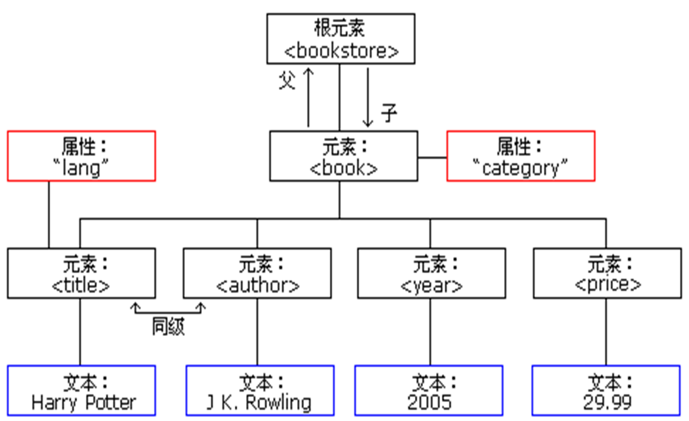

# **XML 与 JSON 结构**

---

## **XML（eXtensible Markup Language）**

### **1. 定义**

- XML 是一种标记语言，用于描述数据的结构和内容。
- 主要用于数据存储与交换。

### **2. 特点**

- **可扩展性**：用户可以自定义标签。
- **层次化结构**：数据以树形结构组织，父子节点关系明确。
- **可读性强**：通过标签可以清楚了解数据的意义。
- **跨平台性**：与不同系统和语言兼容。

### **3. 基本结构**

- **XML 声明**：定义版本和编码方式。

  ```xml
  <?xml version="1.0" encoding="UTF-8"?>
  ```

- **根元素**：每个 XML 文件有且仅有一个根元素。

  ```xml
  <root>
      <!-- 子元素 -->
  </root>
  ```

- **子元素**：嵌套结构表示父子关系。

  ```xml
  <root>
      <child>内容</child>
  </root>
  ```

- **属性**：为标签添加额外信息。

  ```xml
  <person name="Alice" age="25"></person>
  ```

- **注释**：

  ```xml
  <!-- 这是一个注释 -->
  ```

### **4. 优缺点**

- **优点**：
  - 自描述性强，适合复杂数据。
  - 支持多种数据类型。
  - 有丰富的解析库支持。
- **缺点**：
  - 冗余信息多，文件较大。
  - 解析速度相对较慢。

### Example

```xml
<?xml version="1.0" encoding="ISO-8859-1"?>
<bookstore>
<book category="COOKING">
  <title lang="en">Everyday Italian</title> 
  <author>Giada De Laurentiis</author> 
  <year>2005</year> 
  <price>30.00</price> 
</book>
<book category="CHILDREN">
  <title lang="en">Harry Potter</title> 
  <author>J K. Rowling</author> 
  <year>2005</year> 
  <price>29.99</price> 
</book>
<book category="WEB">
  <title lang="en">Learning XML</title> 
  <author>Erik T. Ray</author> 
  <year>2003</year> 
  <price>39.95</price> 
</book>
</bookstore>
```

需要根据xml文件画出结构图如下


---

## **JSON（JavaScript Object Notation）**

### **1. 定义**

- JSON 是一种轻量级的数据交换格式。
- 使用键值对表示数据，适合前后端数据交互。

### **2. 特点**

- **结构简单**：以键值对和数组构成。
- **体积小**：比 XML 更紧凑。
- **可读性强**：易于理解和操作。
- **语言无关性**：与多种语言兼容。

### **3. 基本结构**

- **对象**（Object）：用 `{}` 表示。

  ```json
  {
      "name": "Alice",
      "age": 25
  }
  ```

- **数组**（Array）：用 `[]` 表示。

  ```json
  [
      "apple",
      "banana",
      "cherry"
  ]
  ```

- **键值对**：使用 `key:value` 格式，键为字符串。

  ```json
  {
      "key": "value"
  }
  ```

- **嵌套结构**：对象和数组可以互相嵌套。

  ```json
  {
      "person": {
          "name": "Alice",
          "hobbies": ["reading", "cycling"]
      }
  }
  ```

- **注释**：JSON 不支持注释。

### **4. 优缺点**

- **优点**：
  - 数据格式紧凑，解析速度快。
  - 更适合网络传输。
  - 与 JavaScript 的天然兼容性。
- **缺点**：
  - 不支持注释，影响可维护性。
  - 表达复杂数据结构时不如 XML 灵活。

### Example

```json
{
  "$schema": "http://json-schema.org/schema#",
  "title": "Product",
  "type": "object",
  "required": ["id", "name", "price"],
  "properties": {
    "id": {
      "type": "number",
      "description": "Product identifier"
    },
    "name": {
      "type": "string",
      "description": "Name of the product"
    },
    "price": {
      "type": "number",
      "minimum": 0
    },
    "tags": {
      "type": "array",
      "items": {
        "type": "string"
      }
    },
    "stock": {
      "type": "object",
      "properties": {
        "warehouse": {
          "type": "number"
        },
        "retail": {
          "type": "number"
        }
      }
    }
  }
}
```

---

## **XML vs JSON 对比**

| 特性             | XML                             | JSON                     |
|------------------|---------------------------------|--------------------------|
| **可读性**      | 标签结构易读，但冗余较多         | 简洁，格式紧凑           |
| **体积**        | 文件较大，数据冗余               | 文件较小，数据简洁       |
| **数据类型**    | 支持多种类型                     | 支持基本类型与数组       |
| **层次关系**    | 支持复杂的父子层次关系            | 支持嵌套，但不如 XML 清晰 |
| **解析难度**    | 解析相对复杂                     | 解析简单，解析库丰富     |
| **用途**        | 数据存储、配置文件                | 数据交换、网络传输       |

---

### **总结**

1. XML 适合描述复杂的、具有层次结构的数据，常用于配置文件和文档存储。
2. JSON 更适合高效的网络传输，是前后端通信的主流格式。
3. 选择时应根据场景需求权衡：
   - 数据复杂性高、需兼容多系统：XML。
   - 网络传输需求高、轻量级：JSON。
